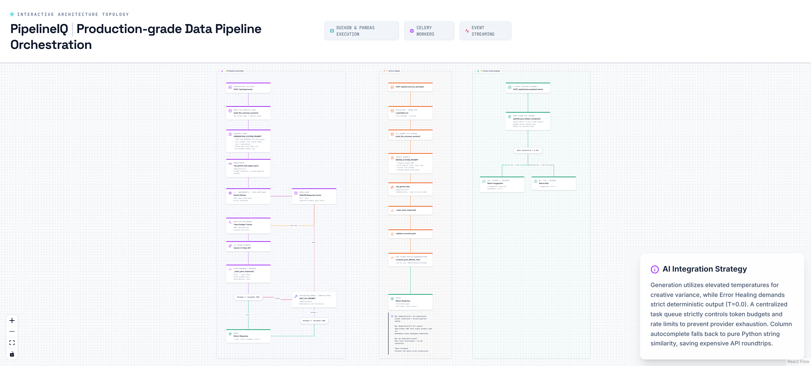

# 6. AI Pipeline Generation & Repair



---

## Overview

PipelineIQ provides three AI-powered features that leverage Google's Gemini 1.5 Flash model: natural language pipeline generation, automated error repair, and column autocomplete. All AI calls are routed through a dedicated Celery worker with strict rate limiting, response caching, and token budget tracking to prevent API abuse and ensure reliability.

---

## Flow A — AI Pipeline Generation

### Request Flow

1. **User types natural language description** in the UI
   - Example: "Show me total revenue by region for completed orders"
   - User selects which uploaded files the pipeline should reference

2. **POST /api/ai/generate** → FastAPI
   - Request body: `{description: "...", file_ids: ["uuid1", "uuid2"]}`

3. **Build file schemas section** (`build_file_schemas_section()`)
   - Query `file_profiles` table for each file_id
   - Extract column names + semantic types from stored profiles
   - Example output: `File: orders.csv — Columns: order_id (int64), revenue (float64), region (object), status (object)`

4. **Assemble GENERATION_SYSTEM_PROMPT**
   - Inject STEP_TYPE_REFERENCE (all 19 step types with descriptions and field schemas)
   - Inject file schemas (real column names from the user's data)
   - Inject user's natural language description
   - Rule: "Output ONLY valid YAML, no markdown fences, no preamble"

5. **Submit to Gemini** via `call_gemini_task.apply_async(queue='gemini', temperature=0.1)`
   - Temperature 0.1: slight creativity for varied pipeline naming (not too deterministic)

6. **Gemini Worker processes the task**
   - Check SHA256 response cache in Redis (same prompt → reuse result)
   - Check token budget (900K/minute rolling window in Redis)
   - Call Gemini 1.5 Flash API (3-8 second response)
   - Cache response with SHA256(prompt) as key

7. **Clean response** (`_clean_yaml_response()`)
   - Strip ```yaml markdown fences
   - Strip preamble text before `pipeline:`
   - Find the `pipeline:` start marker

8. **Validate YAML** (`get_parsed_pipeline()`)
   - Parse YAML structure
   - Validate step types against known types
   - Check file references exist
   - Check column names match file schemas

9. **Self-fix attempt** (if validation fails)
   - Build `SELF_FIX_PROMPT` with validation error + invalid YAML
   - Submit to Gemini (temperature=0.0 — deterministic fix)
   - Validate again

10. **Return response**
    - `{yaml, valid, attempts, error}`
    - Frontend renders the generated pipeline on the React Flow canvas

### Temperature Choices

| Use Case | Temperature | Reason |
|----------|-------------|--------|
| Generation | 0.1 | Slight creativity → varied pipeline naming |
| Repair | 0.0 | Same broken YAML must always produce same fix |
| Healing | 0.0 | Deterministic, reproducible patch |

### Rate Limiting Design

| Property | Value | Purpose |
|----------|-------|---------|
| Worker processes | 1 | Single point of rate enforcement |
| Concurrency | 1 | Only 1 API call at a time |
| `rate_limit` | `'50/m'` | 50 API calls per minute maximum |
| Token budget | 900K/minute | Rolling window in Redis |
| Response cache | SHA256(prompt) → response | Identical prompts reuse result |
| Max retries | 5 | Exponential backoff on 429 errors |

**Why ONE dedicated worker:**
- Multiple workers would each make independent API calls
- Rate limiting across multiple workers requires distributed coordination
- Single worker = single point of enforcement = simple and reliable

---

## Flow B — AI Error Repair

### Request Flow

1. **POST /api/ai/runs/{run_id}/repair** with failed run context

2. **Load failed run data**
   - `failed_step`: which step failed
   - `error_type`: exception class name
   - `error_message`: human-readable error
   - `file_ids`: files referenced by the pipeline
   - `yaml_config`: the original pipeline YAML

3. **Build REPAIR_SYSTEM_PROMPT**
   - Original broken YAML
   - Error details (step, type, message)
   - Current file schemas (column names + types)
   - Instruction: "Make the MINIMUM change to fix this error"

4. **Call Gemini** (temperature=0.0 — deterministic repair)
   - Same broken YAML must always produce same fix
   - Randomness makes debugging impossible

5. **Clean and validate** corrected YAML

6. **Compute YAML diff** (`compute_yaml_diff()`)
   - Line-by-line diff using `difflib.SequenceMatcher`
   - Returns: `{corrected_yaml, diff_lines, valid, error}`
   - Diff lines show exactly what changed (added/removed/unchanged)

7. **Return to frontend**
   - User sees the corrected YAML with highlighted diff
   - User can accept or reject the repair

---

## Flow C — Column Autocomplete

### Request Flow

1. **POST /api/ai/autocomplete/column**
   - Request body: `{typed: "reveue", available_columns: ["revenue", "region", "order_id"]}`

2. **Pure Python similarity scoring** (NO Gemini call needed)
   - `jellyfish.jaro_winkler_similarity(typed.lower(), column.lower())`
   - Weights prefix matches more (better for mid-word typos)
   - Threshold 0.85: "reveue" → "revenue" (confidence: 0.95)
   - Below threshold: "xyz" → null (no match)

3. **Return response**
   - `{suggestion: "revenue", confidence: 0.95}` or `{suggestion: null}`

### Why No Gemini Call

- Column autocomplete is a local, instant operation
- Jaro-Winkler similarity is O(n) where n = number of columns
- Gemini API call would add 3-8 seconds latency
- No creative generation needed — just fuzzy string matching

---

## Prompt Engineering Patterns

### GENERATION_SYSTEM_PROMPT

```
You are a data pipeline generator. Given the user's description and available
file schemas, generate a valid YAML pipeline configuration.

RULES:
1. Output ONLY valid YAML starting with "pipeline:"
2. Use ONLY the column names from the provided file schemas
3. Use ONLY step types from the STEP_TYPE_REFERENCE
4. Do NOT include markdown fences or preamble text
5. Each step must have a unique name
6. Steps must be in logical execution order
```

### REPAIR_SYSTEM_PROMPT

```
You are a pipeline repair agent. A pipeline step failed with an error.
Make the MINIMUM change to fix the error.

ORIGINAL YAML:
{yaml}

ERROR:
Step: {failed_step}
Type: {error_type}
Message: {error_message}

FILE SCHEMAS:
{file_schemas}

Return the corrected YAML. Change only what's necessary.
```

---

## Key Source Files

| File | Lines | Purpose |
|------|-------|---------|
| `backend/routers/ai.py` | 353 | AI endpoints (generate, repair, autocomplete) |
| `backend/ai/` | — | Gemini task definitions, prompt templates |
| `backend/tasks/gemini_tasks.py` | — | Celery task for Gemini API calls |
| `backend/pipeline/cache.py` | — | SHA256 response caching |
