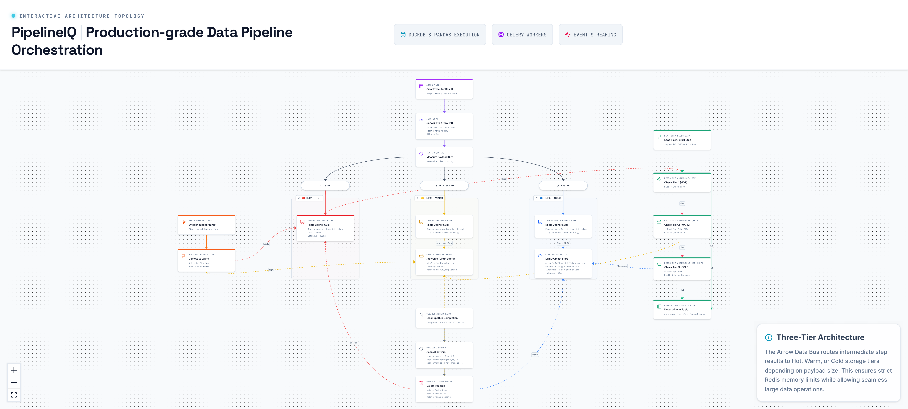

# 4. Three-Tier Arrow Data Bus



---

## Overview

The ArrowDataBus is PipelineIQ's inter-step data transport layer. It solves a critical performance problem: how to move large Arrow Tables between pipeline steps without copying data or blocking the event loop. The solution is a three-tier storage system that automatically routes data to the optimal storage backend based on payload size, balancing latency against memory cost.

---

## Why Arrow IPC Instead of Pickle

| Property | Arrow IPC | Pickle |
|----------|-----------|--------|
| Format | Native binary (starts with `ARROW1` magic bytes) | Python-specific serialized object |
| Deserialization | Zero-copy, ~microseconds | Full object reconstruction, 5-10x slower |
| Cross-language | Any language can read Arrow | Python-only |
| Memory | Memory-mapped, shared between processes | Requires full deserialization into Python heap |
| Schema | Self-describing (column names, types embedded) | Requires unpickling with matching class definitions |
| Safety | Safe — no arbitrary code execution | Unsafe — pickle can execute arbitrary code during deserialization |

Arrow IPC is the correct choice because:
- PipelineIQ uses Arrow Tables as the universal in-memory data format
- DuckDB reads Arrow natively (zero-copy registration)
- Pandas converts to/from Arrow with minimal overhead
- The same data may be read by multiple workers (column policies, contract validation)

---

## The Three Tiers

### Tier 1 — HOT (Redis-cache:6381)

| Property | Value |
|----------|-------|
| Threshold | payload < 10 MB |
| Storage | Redis-cache :6381 |
| Format | Arrow IPC binary (raw bytes) |
| Key format | `arrow:hot:{run_id}:{step_name}` |
| Access latency | ~0.2ms (Redis GET) |
| TTL | 1 hour (`setex` with `HOT_TTL_SECONDS=3600`) |
| Use case | Small filtered/aggregated results, intermediate steps |

**How it works:**
- Serialize Arrow Table to IPC bytes: `table_ipc = table.to_ipc()`
- Store directly in Redis: `redis.setex(key, HOT_TTL_SECONDS, table_ipc)`
- Retrieve: `redis.get(key)` → deserialize: `pa.ipc.open_stream(buffer).read_all()`

### Tier 2 — WARM (/dev/shm Linux shared memory)

| Property | Value |
|----------|-------|
| Threshold | 10 MB ≤ payload < 500 MB |
| Storage | /dev/shm (Linux tmpfs, RAM-backed filesystem) |
| Format | Arrow IPC files (.arrow extension) |
| Key format | `arrow:warm:{run_id}:{step_name}` (Redis pointer to shm path) |
| File path | `/dev/shm/pipelineiq_{sha256_hash[:16]}.arrow` |
| Access latency | ~0.5ms (memory-mapped file read) |
| Lifetime | Deleted on run completion (NOT on TTL) |
| Use case | Medium-sized datasets, join results, aggregations |

**How it works:**
- Serialize Arrow Table to IPC bytes
- Write to shm file: `with open(shm_path, 'wb') as f: f.write(table_ipc)`
- Store Redis pointer: `redis.setex(key, WARM_TTL, shm_path)` (TTL 4 hours, pointer only)
- Retrieve: `redis.get(key)` → read file → deserialize
- File naming uses SHA256 digest for uniqueness

### Tier 3 — COLD (MinIO pipelineiq-spills)

| Property | Value |
|----------|-------|
| Threshold | payload ≥ 500 MB |
| Storage | MinIO `pipelineiq-spills` bucket |
| Format | Apache Parquet with Snappy compression |
| Object path | `arrow/cold/{run_id}/{step_name}.parquet` |
| Key format | `arrow:cold_ref:{run_id}:{step_name}` (Redis pointer to object path) |
| Access latency | ~50ms (network + decompress) |
| Lifecycle | 2-day MinIO lifecycle policy auto-deletes |
| Use case | Large source files, unfiltered datasets |

**How it works:**
- Convert Arrow Table to Parquet: `pq.write_table(table, buffer, compression='snappy')`
- Upload to MinIO: `minio.put_object(bucket, object_path, buffer)`
- Store Redis pointer: `redis.setex(key, COLD_TTL, object_path)` (TTL 48 hours)
- Retrieve: `redis.get(key)` → download from MinIO → read Parquet → Arrow Table

---

## Store Flow (called by SmartExecutor after each step)

```
1. Serialize table to IPC bytes
   table_ipc = table.to_ipc()

2. Measure payload size
   payload_size = len(table_ipc)

3. Select tier based on thresholds
   if payload_size < 10MB:       → Hot tier (Redis)
   elif payload_size < 500MB:    → Warm tier (/dev/shm)
   else:                         → Cold tier (MinIO Parquet)

4. Write to selected tier
   Hot:  redis.setex(key, TTL, table_ipc)
   Warm: write to shm file + redis.setex(pointer_key, TTL, path)
   Cold: upload Parquet to MinIO + redis.setex(pointer_key, TTL, object_path)

5. Store lookup key in Redis (for warm/cold tiers)
   Always store a Redis key for O(1) lookup regardless of tier
```

## Load Flow (called before next step)

```
1. Check Tier 1 (Redis) — O(1) hash lookup
   result = redis.get(f"arrow:hot:{run_id}:{step}")
   if result: return pa.ipc.open_stream(result).read_all()

2. If miss: check Tier 2 (Redis lookup → shm path → file read)
   shm_path = redis.get(f"arrow:warm:{run_id}:{step}")
   if shm_path:
       with open(shm_path, 'rb') as f: buffer = f.read()
       return pa.ipc.open_stream(buffer).read_all()

3. If miss: check Tier 3 (Redis lookup → MinIO → Parquet)
   object_path = redis.get(f"arrow:cold_ref:{run_id}:{step}")
   if object_path:
       data = minio.get_object(bucket, object_path)
       return pq.read_table(data)
```

## Eviction Flow (background Celery task)

When Redis memory exceeds 90% capacity:

```
1. Find largest hot entries
   keys = redis.scan_iter("arrow:hot:*")
   largest = sorted(keys, key=lambda k: redis.strlen(k), reverse=True)[:10]

2. For each largest entry:
   a. Read IPC bytes from Redis
   b. Write to /dev/shm (warm tier)
   c. Update Redis pointer to point to shm path
   d. Delete original hot entry
```

This moves the largest payloads to warm tier while keeping them accessible.

## Cleanup Flow (run completion)

`ArrowDataBus.cleanup_run(run_id)` scans all 3 tiers simultaneously:

```
1. Scan Redis for all arrow keys matching this run_id
   Hot keys:  arrow:hot:{run_id}:*
   Warm keys: arrow:warm:{run_id}:*
   Cold keys: arrow:cold_ref:{run_id}:*

2. Delete Redis keys
   redis.delete(*hot_keys, *warm_keys, *cold_keys)

3. Delete shm files
   for path in warm_values: os.unlink(path)

4. Delete MinIO objects
   for object_path in cold_values: minio.remove_object(bucket, object_path)
```

**Idempotent** — safe to call multiple times. Called in the `finally` block of `execute_pipeline_task`.

---

## Tier Statistics

The ArrowDataBus tracks per-tier statistics:
- Total entries per tier
- Total bytes per tier
- Average entry size
- Hit/miss rates (for monitoring cache effectiveness)

These are exposed via `GET /api/debug/arrow-bus/stats` for operational visibility.

---

## Key Source Files

| File | Lines | Purpose |
|------|-------|---------|
| `backend/execution/arrow_bus.py` | 722 | `ArrowDataBus` class with all tier logic |
| `backend/execution/shm_store.py` | 138 | `/dev/shm` warm tier storage |
| `backend/config.py` | 297 | `REDIS_CACHE_URL`, tier threshold constants |
