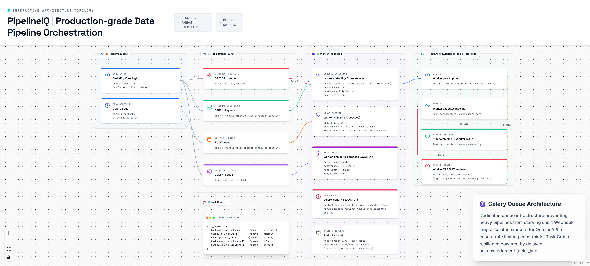

# 14. Celery Task Queue Architecture

> Four specialized queues with worker isolation, rate limiting, and crash-safe acknowledgment.

## Architecture Diagram



---

## Overview

PipelineIQ uses a four-queue Celery architecture to isolate different workload types and prevent resource contention. Each queue has dedicated workers with tuned concurrency settings, ensuring that long-running bulk operations don't block critical webhook deliveries, and that AI API calls are rate-limited to exactly one concurrent request. The system uses `acks_late=True` for crash-safe task acknowledgment — if a worker crashes mid-run, the task stays in the queue and is automatically requeued for another worker.

---

## Four Queues

| Queue | Workers | Tasks Routed | Purpose | Priority |
|-------|---------|-------------|---------|----------|
| **critical** | worker-default (routed) | `deliver_webhook` | Webhook delivery must happen fast, not behind slow pipeline runs | Highest |
| **default** | worker-default ×2, concurrency=4 | `execute_pipeline`, `run_streaming_pipeline` | Normal user-triggered pipeline runs | Normal |
| **bulk** | worker-bulk ×2, concurrency=2 | `profile_file`, `execute_scheduled_pipeline` | Long-running, CPU/memory intensive operations | Low |
| **gemini** | worker-gemini ×1, concurrency=1 | `call_gemini_task` | Rate limit enforcement — 1 worker × concurrency=1 = 1 active call max | Normal |

---

## Worker Configuration

| Worker | Processes | Concurrency | Prefetch Multiplier | Ack Mode | Purpose |
|--------|-----------|-------------|---------------------|----------|---------|
| worker-default | 2 | 4 | 1 | Late | Pipeline steps + critical webhooks |
| worker-bulk | 2 | 2 | 1 | Late | Profiling + scheduled runs |
| worker-gemini | 1 | 1 | 1 | Late | AI calls only, rate_limit='50/m' |
| celery-beat | 1 | — | — | — | Cron dispatcher (singleton) |

### Concurrency Rationale

- **worker-default (concurrency=4)**: Standard throughput for pipeline execution. Each worker handles 4 concurrent tasks.
- **worker-bulk (concurrency=2)**: Lower concurrency prevents OOM on memory-intensive profiling and scheduled pipeline runs. Each worker handles only 2 concurrent tasks.
- **worker-gemini (concurrency=1)**: Strictly single-threaded to enforce rate limiting. Combined with `rate_limit='50/m'`, this ensures exactly 1 active Gemini API call at a time across the entire cluster.

### Prefetch Multiplier

All workers use `prefetch_multiplier=1` — each worker fetches exactly one task at a time from the broker. This prevents a single worker from hoarding tasks while other workers sit idle.

---

## Task Acknowledgment (acks_late=True)

```
1. Worker picks up task (does NOT ack yet)
2. Worker executes pipeline run
3. Only after SUCCESS or explicit failure: worker acks
4. If worker CRASHES mid-run: task stays in queue, another worker picks it up
```

This prevents data loss on crash — the task is never lost, just requeued. The trade-off is that crashed tasks may execute twice (idempotency is handled at the task level via run status checks).

---

## Task Routing

Defined in `backend/celery_config.py`:

```python
task_routes = {
    'tasks.deliver_webhook':              {'queue': 'critical'},
    'tasks.call_gemini':                  {'queue': 'gemini'},
    'tasks.profile_file':                 {'queue': 'bulk'},
    'tasks.execute_scheduled_pipeline':   {'queue': 'bulk'},
    # All other tasks → default queue
}
```

Tasks not explicitly routed fall through to the default queue.

---

## Singleton Requirements

| Component | Replicas | Why |
|-----------|----------|-----|
| celery-beat | Exactly 1 | Multiple Beat instances = duplicate scheduled tasks at every interval |
| worker-gemini | Exactly 1 with concurrency=1 | Multiple replicas defeat the rate limit design |

These are enforced in the Kubernetes manifests with `replicas: 1` and comments explaining the constraint.

---

## Redis Infrastructure

PipelineIQ uses four separate Redis instances to prevent contention:

| Instance | Port | Purpose | Data |
|----------|------|---------|------|
| redis-broker | 6379 | Celery task broker | Task state (PENDING/STARTED/SUCCESS/FAILURE), result backend |
| redis-pubsub | 6380 | SSE event channels | Real-time streaming events for frontend |
| redis-cache | 6381 | LRU cache, policy cache | Column policies, profiling cache, Arrow hot tier |
| redis-yjs | 6382 | CRDT document state | Yjs document snapshots for multiplayer editing |

---

## Task Lifecycle

1. **Producer submits** → `apply_async(queue='critical')` or Beat fires cron task
2. **Broker queues** → Redis stores task message in the appropriate queue list
3. **Worker fetches** → Prefetches one task (prefetch_multiplier=1)
4. **Worker executes** → Runs task function, updates state to STARTED
5. **Worker acks** → On success or explicit failure, task removed from queue
6. **Worker crashes** → Task not acked, stays in queue, requeued for another worker

---

## Deployment Topology

| Worker | K8s Replicas | Total Processes | Total Concurrency |
|--------|-------------|-----------------|-------------------|
| worker-default | 2 | 4 | 16 |
| worker-bulk | 2 | 4 | 8 |
| worker-gemini | 1 | 1 | 1 |
| celery-beat | 1 | 1 | — |
| **Total** | **6 pods** | **10 processes** | **25 concurrent tasks** |

---

## Key Source Files

- `backend/celery_config.py:64` — Queue routing and execution defaults
- `backend/celery_app.py:105` — Celery app, worker init/shutdown hooks
- `backend/tasks/pipeline_tasks.py:1114` — Main pipeline execution task
- `backend/tasks/webhook_tasks.py` — Webhook delivery task
- `backend/tasks/scheduled_pipeline.py:112` — Scheduled pipeline trigger
