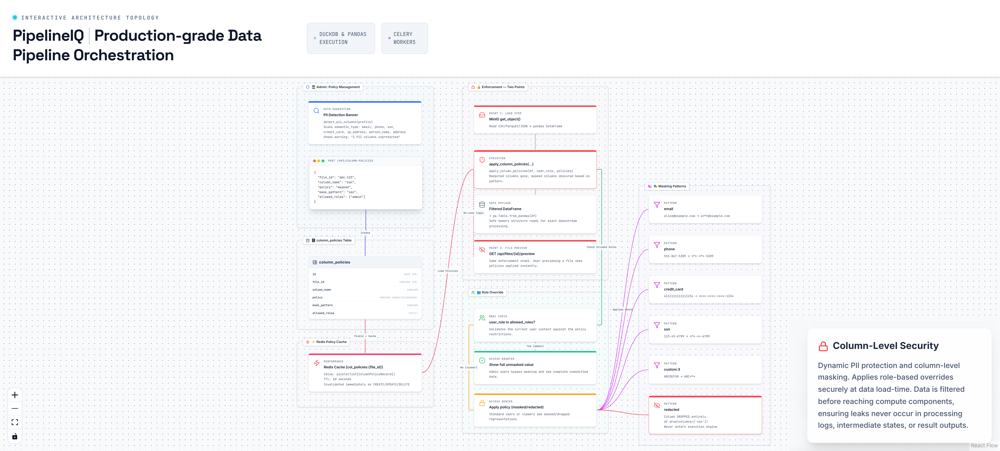

# 13. Column-Level Security & PII Enforcement

> Policy-based column redaction and masking applied before data enters the execution engine.

## Architecture Diagram

---

## Overview

PipelineIQ enforces column-level security at two critical enforcement points: during pipeline execution (load step) and during file preview via the REST API. Policies are stored in PostgreSQL, cached in Redis with a 60-second TTL, and applied before data enters the execution engine. The system supports two policy types — `redacted` (entire column dropped) and `masked` (partial obscuration via pattern matching) — with role-based overrides that allow admin users to bypass masking and see full unmasked values.

A PII detection banner scans profiler metadata for sensitive column types (`email`, `phone`, `ssn`, `credit_card`, `ip_address`, `person_name`, `address`) and alerts users when unprotected PII columns exist.

---

## Policy Types

| Policy | Behavior | Data Safety | Implementation |
|--------|----------|-------------|----------------|
| `redacted` | Column DROPPED entirely from DataFrame | Data never enters execution engine | `df.drop(columns=[col_name])` |
| `masked` | Column partially obscured via pattern-based masking | Data visible but sensitive parts hidden | Pattern-specific string manipulation |

---

## Masking Patterns Reference

| Pattern | Input Example | Output Example | Logic |
|---------|--------------|----------------|-------|
| `email` | `alice@example.com` | `a***@example.com` | First char + `***` + `@` + domain |
| `phone` | `555-867-5309` | `***-***-5309` | Last 4 digits preserved, rest masked |
| `credit_card` | `4111111111111234` | `****-****-****-1234` | Last 4 digits preserved, rest masked |
| `ssn` | `123-45-6789` | `***-**-6789` | Last 4 digits preserved, rest masked |
| `custom:N` | `ABCDEFGH` (N=3) | `ABC***` | First N characters preserved, rest masked |
| `redacted` | (entire column) | Column removed from DataFrame | `df.drop(columns=[col_name])` |

---

## Role-Based Override

The `allowed_roles` field on each policy controls which user roles see full unmasked data:

- **Admin role**: Sees the complete unmasked column value (bypasses masking)
- **Viewer role**: Sees the masked/redacted version (default behavior)
- Role is resolved from pipeline run context: `run.owner_role`

The override is evaluated at enforcement time — `user_role in allowed_roles` determines whether the full column is returned or the masked version is applied.

---

## Enforcement Points

| Enforcement Point | When Triggered | What Happens | Code Path |
|-------------------|----------------|--------------|-----------|
| Load step execution | After MinIO read, BEFORE pipeline processing | `apply_column_policies(df, user_role, policies)` filters DataFrame | `backend/pipeline/runner.py` |
| File preview | `GET /api/files/{id}/preview` | Same enforcement applied to preview response | `backend/routers/column_policies.py` |

Both enforcement points use the same `apply_column_policies()` function, ensuring consistent policy application regardless of access method.

---

## Caching Architecture

Policies are cached in Redis-cache (port 6381) to avoid repeated database lookups:

| Property | Value |
|----------|-------|
| Cache key format | `col_policies:{file_id}` |
| Cache value | `pickle(list[ColumnPolicyRecord])` |
| TTL | 60 seconds (short — policy changes propagate quickly) |
| Invalidation | Immediate on CREATE/UPDATE/DELETE of any policy for the file |

The short TTL ensures policy changes (e.g., adding a new column protection) take effect within 60 seconds across all running processes.

---

## PII Detection System

`detect_pii_columns(profile)` scans the data profiler's `semantic_type` field to identify unprotected PII:

| PII Type | Detection Method |
|----------|-----------------|
| `email` | Regex pattern matching for email format |
| `phone` | Regex pattern matching for phone number format |
| `ssn` | Regex pattern matching for SSN format |
| `credit_card` | Luhn algorithm validation + regex |
| `ip_address` | IPv4/IPv6 pattern matching |
| `person_name` | NLP-based name detection |
| `address` | NLP-based address detection |

When unprotected PII columns are detected, the UI displays a yellow warning banner: "3 PII columns have no policy — set one?" prompting the user to configure column policies before running the pipeline.

---

## Data Flow

1. **Admin creates policy** → `POST /api/column-policies` with `file_id`, `column_name`, `policy`, `mask_pattern`, `allowed_roles`
2. **Policy stored** → PostgreSQL `column_policies` table with `UNIQUE(file_id, column_name)`
3. **Cache invalidated** → Redis key `col_policies:{file_id}` deleted immediately
4. **Pipeline runs** → Load step reads file from MinIO, calls `apply_column_policies(df, user_role, policies)`
5. **Role check** → If `user_role in allowed_roles`, full column returned; otherwise masking applied
6. **Filtered DataFrame** → Safe data enters execution engine (no PII exposed to unauthorized roles)

---

## Security Properties

| Property | Guarantee |
|----------|-----------|
| Data never leaves enforcement | Redacted columns dropped before execution engine |
| Role isolation | Admin sees full data, viewers see masked |
| Audit trail | Policy CRUD operations logged |
| Cache freshness | 60-second max staleness |
| Dual enforcement | Same function at load step AND preview |

---

## Key Source Files

- `backend/routers/column_policies.py:136` — Policy CRUD API endpoints
- `backend/models/column_policy.py:62` — `ColumnPolicyRecord` model definition
- `backend/pipeline/runner.py` — `apply_column_policies()` integration in load steps
- `backend/services/column_policy_service.py` — Policy caching and PII detection logic
