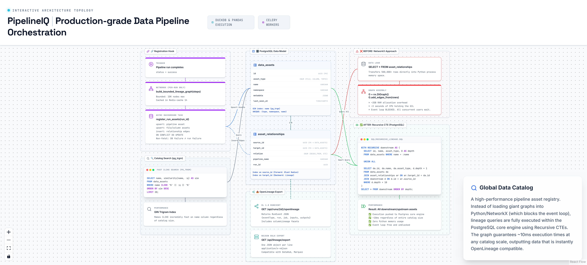

# 10. Data Catalog & Blast Radius Analysis



---

## Overview

PipelineIQ's Global Data Catalog tracks every data asset (files, columns, pipelines, topics) and their relationships in a PostgreSQL graph. The blast radius analysis uses PostgreSQL recursive CTEs to traverse this graph in ~10ms regardless of catalog size — replacing a NetworkX approach that required ~2GB RAM and blocked the event loop for 3 seconds.

---

## The Problem with NetworkX

**BEFORE (broken approach):**

```python
# 1. Load ALL relationships into Python
SELECT * FROM asset_relationships;  # → 500,000 rows

# 2. Build graph in memory
G = nx.DiGraph()
G.add_edges_from(all_edges)  # → ~2GB RAM allocation

# 3. Traverse graph
downstream = nx.descendants(G, "customer_id")  # → ~3s CPU holding GIL

# Result: Event loop BLOCKED for 3 seconds. All concurrent users wait.
```

**Problems:**
- ~2GB RAM for 500K edges
- ~3s CPU time holding Python's GIL
- Event loop completely blocked
- Scales linearly with catalog size (worse as catalog grows)

---

## The Solution: PostgreSQL Recursive CTE

**AFTER (fixed approach):**

```sql
WITH RECURSIVE downstream AS (
    SELECT id, name, asset_type, 0 AS depth
    FROM data_assets
    WHERE name = :name
    UNION ALL
    SELECT da.id, da.name, da.asset_type, d.depth + 1
    FROM data_assets da
    JOIN asset_relationships ar ON ar.target_id = da.id
    JOIN downstream d ON d.id = ar.source_id
    WHERE d.depth < 10
)
SELECT id, name, asset_type, depth
FROM downstream
ORDER BY depth;
```

**Why this works:**
- Graph traversal happens INSIDE PostgreSQL
- Uses indexed lookups (`source_id` index + `target_id` index)
- ~10ms regardless of catalog size
- Zero Python memory for graph
- Event loop never blocked

---

## Data Model

### data_assets Table

| Column | Type | Purpose |
|--------|------|---------|
| `id` | UUID | Primary key |
| `asset_type` | enum | `file`, `column`, `pipeline`, `topic` |
| `name` | text | Asset identifier (e.g., "customer_id", "revenue_report") |
| `namespace` | text | `minio://uploads`, `pipeline://`, `redpanda://` |
| `metadata` | JSONB | Flexible key-value metadata |
| `last_seen_at` | timestamp | Updated every run (orphan detection at 90 days) |

**Indexes:**
- GIN trigram on `name` (`pg_trgm`): fast `ILIKE` + `similarity()` search
- UNIQUE constraint on `(asset_type, namespace, name)`: prevents duplicates

### asset_relationships Table

| Column | Type | Purpose |
|--------|------|---------|
| `source_id` | FK → data_assets | Upstream asset (the "reads from" side) |
| `target_id` | FK → data_assets | Downstream asset (the "writes to" side) |
| `relation` | enum | `reads_from`, `writes_to`, `transforms`, `joins` |
| `pipeline_name` | text | Which pipeline created this edge |
| `run_id` | UUID | Which specific run created this edge |

**Indexes:**
- `source_id`: forward blast radius queries (what breaks if this changes?)
- `target_id`: backward lineage queries (where does this come from?)

---

## Registration Hook

After every successful pipeline run:

```
register_run_assets(run_id, pipeline_name, lineage_graph, owner_id)
  → Upsert pipeline as asset
  → Upsert each lineage node as file/column/topic asset
  → Insert edges as relationships
  → ON CONFLICT DO UPDATE (last_seen_at, metadata)
```

**Non-fatal:** A database failure during registration does NOT fail the run. The catalog is a read-heavy system — occasional missed registrations are acceptable.

---

## Two Query Directions

### Forward (Blast Radius)

**Question:** "What breaks if `customer_id` changes?"

```sql
WITH RECURSIVE downstream AS (
    SELECT id, name, asset_type, 0 AS depth
    FROM data_assets WHERE name = 'customer_id'
    UNION ALL
    SELECT da.id, da.name, da.asset_type, d.depth + 1
    FROM data_assets da
    JOIN asset_relationships ar ON ar.target_id = da.id
    JOIN downstream d ON d.id = ar.source_id
    WHERE d.depth < 10
)
SELECT * FROM downstream ORDER BY depth;
```

**Result:** All downstream assets that depend on `customer_id`, organized by depth.

### Backward (Lineage)

**Question:** "Where does `revenue_sum` come from?"

```sql
WITH RECURSIVE upstream AS (
    SELECT id, name, asset_type, 0 AS depth
    FROM data_assets WHERE name = 'revenue_sum'
    UNION ALL
    SELECT da.id, da.name, da.asset_type, d.depth + 1
    FROM data_assets da
    JOIN asset_relationships ar ON ar.source_id = da.id
    JOIN upstream d ON d.id = ar.target_id
    WHERE d.depth < 10
)
SELECT * FROM upstream ORDER BY depth;
```

**Result:** All upstream assets that feed into `revenue_sum`, organized by depth.

---

## Catalog Search (pg_trgm)

```sql
SELECT name, similarity(name, :query) AS sim
FROM data_assets
WHERE name ILIKE '%' || :query || '%'
ORDER BY sim DESC
LIMIT 20;
```

The GIN trigram index makes `ILIKE` fast on the `name` column, even with partial matches.

---

## OpenLineage Export

### Single Run Export
```
GET /api/runs/{id}/openlineage
→ OL 1.0 RunEvent JSON
{eventType, run, job, inputs, outputs, columnLineage facets}
```

### Bulk Export
```
GET /api/lineage/export
→ NDJSON bulk export (one JSON object per line)
→ Content-Type: application/x-ndjson
→ Compatible with: DataHub, Marquez, OpenMetadata, Apache Atlas
```

---

## Key Source Files

| File | Lines | Purpose |
|------|-------|---------|
| `backend/repositories/catalog.py` | — | `register_run_assets()`, `register_step_assets()` |
| `backend/routers/catalog.py` | 195 | Catalog search and blast radius API |
| `backend/routers/lineage_export.py` | 133 | OpenLineage export |
| `backend/openlineage/` | — | OL 1.0 event serialization |
| `backend/models/__init__.py` | 792 | DataAsset, AssetRelationship models |
