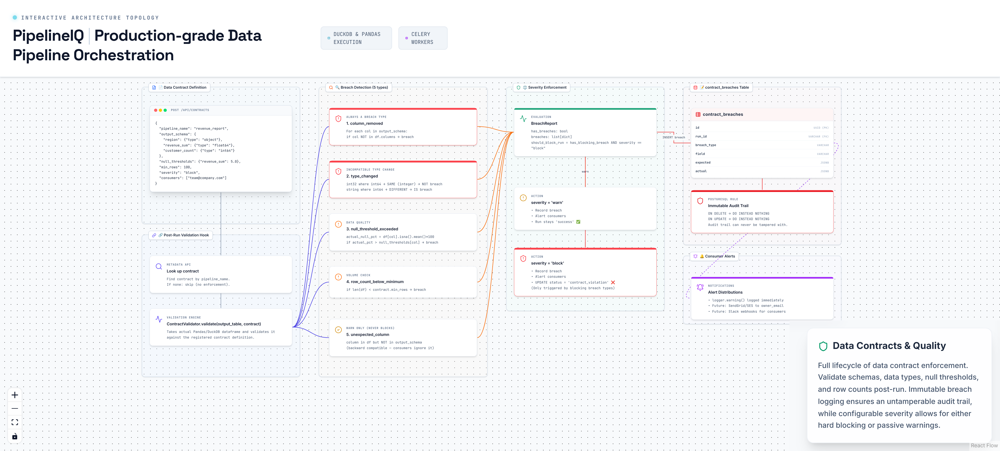

# 12. Data Contracts & Breach Detection



---

## Overview

PipelineIQ's data contract system provides schema commitments: "this pipeline will ALWAYS produce these columns with these types." Contracts define expected output schemas, null thresholds, row count bounds, and severity levels. After every pipeline run, the contract validator checks the output against the active contract and enforces breaches according to severity — either warning or blocking the run.

---

## What a Contract Is

A data contract is a JSON schema commitment attached to a pipeline:

```json
{
  "pipeline_name": "revenue_report",
  "output_schema": {
    "customer_id": {"type": "int64"},
    "revenue_sum": {"type": "float64"},
    "region": {"type": "object"},
    "customer_count": {"type": "int64"}
  },
  "null_thresholds": {
    "revenue_sum": 5.0
  },
  "min_rows": 100,
  "max_rows": 1000000,
  "severity": "block",
  "consumers": ["team@company.com", "data-ops@company.com"]
}
```

**Fields:**
- `output_schema`: expected columns with their types
- `null_thresholds`: maximum allowed null percentage per column
- `min_rows` / `max_rows`: row count bounds
- `severity`: `warn` (record + alert) or `block` (record + alert + fail run)
- `consumers`: email/webhook addresses to notify on breach

---

## 5 Breach Types

### 1. column_removed

**Detection:** Promised column missing from output
**Example:** Contract says `revenue_sum` must exist, but output doesn't have it
**Severity:** ALWAYS a breach (never warn-only)
**Impact:** Downstream consumers expecting this column will fail

### 2. type_changed

**Detection:** `TYPE_CATEGORY_MAP[actual] != TYPE_CATEGORY_MAP[expected]`
**Example:** `revenue_sum` is `object` (string) where `float64` was promised
**Severity:** Breach
**Impact:** Type coercion failures in downstream processing

**Type Category Map:**
```
int8/int16/int32/int64 → "integer"
float32/float64 → "float"
string/object → "string"
```

**Key detail:** int32 where int64 promised → SAME category → NOT a breach. This is because int32 is a subset of int64 — downstream consumers expecting int64 can handle int32.

### 3. null_threshold_exceeded

**Detection:** `actual_null_pct > null_thresholds[column]`
**Example:** `revenue_sum` has 15% nulls vs 5% max allowed
**Severity:** Breach
**Impact:** Aggregations, joins, and calculations may produce incorrect results

### 4. row_count_below_minimum

**Detection:** `len(df) < contract.min_rows`
**Example:** 50 rows vs min_rows=100
**Severity:** Breach
**Impact:** Insufficient data for statistical validity

### 5. unexpected_column

**Detection:** Column exists in output but NOT in contract's `output_schema`
**Example:** Output has `bonus_column` not in the contract
**Severity:** **WARN ONLY** — never blocks
**Impact:** None — backward compatible, consumers ignore extra columns

---

## Severity Enforcement

| Severity | Behavior |
|----------|----------|
| `warn` | Record breach + alert consumers, run stays `success` |
| `block` | Record breach + alert consumers, run → `contract_violation` |

**Which breach types can trigger `block`:**
- column_removed ✓
- type_changed ✓
- null_threshold_exceeded ✓
- row_count violations ✓
- unexpected_column ✗ (never blocks — backward compatible)

---

## Post-Run Validation Hook

After every successful pipeline run:

```
1. Look up active contract for this pipeline_name
   → If no contract: skip (no enforcement)

2. Validate output_table against contract
   → validate_against_contract(output_table, yaml_content)

3. If violations found:
   → INSERT contract_breaches (immutable per PostgreSQL RULE)
   → _alert_consumers(): log + future Slack/email

4. If should_block_run:
   → UPDATE status = 'contract_violation'
   → Block downstream schedules (push next_run_at forward by 1 hour)
```

**Non-fatal:** Contract validation failure doesn't fail the run (unless severity=block).

---

## Immutability

`contract_breaches` table uses PostgreSQL RULEs:

```sql
CREATE RULE contract_breaches_no_delete AS
  ON DELETE TO contract_breaches DO INSTEAD NOTHING;

CREATE RULE contract_breaches_no_update AS
  ON UPDATE TO contract_breaches DO INSTEAD NOTHING;
```

**Audit trail can never be tampered with.** Every breach is recorded forever.

---

## Consumer Blocking

When a contract breach has `severity=block`, downstream schedules are temporarily blocked:

```python
def _block_downstream_schedules(db, breached_pipeline_name, consumers):
    for consumer_name in consumers:
        # Find active schedules for downstream pipelines
        # Push their next_run_at forward by 1 hour
        update(PipelineSchedule)
        .where(pipeline_name == consumer_name, is_active == True)
        .values(next_run_at = utcnow() + timedelta(hours=1))
```

This gives engineers time to investigate and fix the breach before dependent pipelines run against bad data.

---

## Key Source Files

| File | Lines | Purpose |
|------|-------|---------|
| `backend/contracts/` | — | Contract validation logic |
| `backend/routers/contracts.py` | 205 | Contract CRUD API |
| `backend/models/data_contract.py` | 71 | Contract model |
| `backend/models/contract_breach.py` | 55 | Breach record model |
| `backend/tasks/pipeline_tasks.py` | 1114 | `check_and_enforce_contract()` integration |
