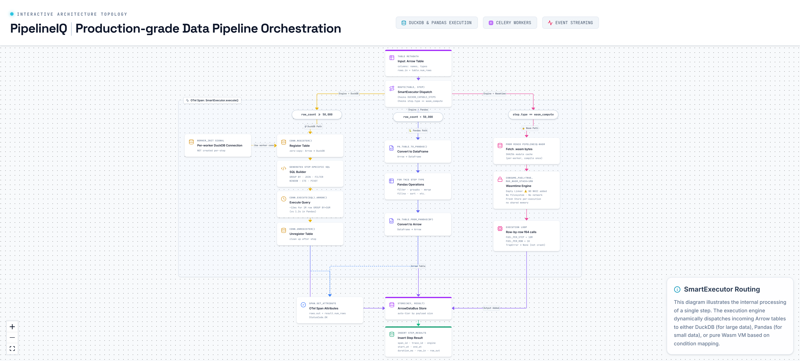

# 3. Execution Engine — SmartExecutor



---

## Overview

The SmartExecutor is the central routing component in PipelineIQ's execution engine. Every pipeline step passes through it, and it directs the step to the correct execution path based on two criteria: the step type and the row count of the input data. This design optimizes for both performance (DuckDB for large datasets) and flexibility (Pandas for small/complex logic), while providing a secure sandbox for user-defined WebAssembly functions.

---

## Three Execution Paths

### Path A — DuckDB (for row count >= 50,000)

**When it's used:**
- Input Arrow Table has >= 50,000 rows
- Step type is one of: filter, select, sort, aggregate, join, deduplicate, fill_nulls, sample, pivot, unpivot, sql

**How it works:**

1. **Per-worker DuckDB connection** — initialized once by `worker_init` signal, NOT created per-step
   - Each Celery worker process gets its own DuckDB connection
   - Connection reused across all steps in all pipeline runs on that worker
   - Dynamic thread count tuning based on available CPU cores

2. **Table registration** — `conn.register(table_alias, arrow_table)`
   - Zero-copy: Arrow memory is shared with DuckDB (no serialization)
   - DuckDB reads Arrow columnar format natively

3. **SQL generation** — `backend/execution/sql_builder.py`
   - Translates typed step configs into DuckDB SQL
   - Supports: GROUP BY, JOIN, FILTER, WINDOW, CTE, PIVOT, UNPIVOT, RAW SQL
   - SQL validation: single statement only, SELECT/CTE only, no write/admin keywords

4. **Execution** — `conn.execute(sql).arrow()`
   - Returns Arrow Table directly (zero-copy from DuckDB result)
   - Performance: ~12ms for GROUP BY + SUM on 1M rows
   - Compare: ~1.2s in Pandas (100x slower)

5. **Cleanup** — `conn.unregister(table_alias)`
   - Removes the registered table from DuckDB's catalog
   - Prevents memory leaks across steps

**Performance characteristics:**
- Vectorized execution: processes entire columns at once (SIMD-friendly)
- Memory-efficient: only touches relevant columns (columnar storage)
- Parallel execution: automatically uses multiple CPU cores
- Zero-copy Arrow integration: no data conversion overhead

### Path B — Pandas (for row count < 50,000)

**When it's used:**
- Input Arrow Table has < 50,000 rows
- Any step type (fallback for small datasets)

**How it works:**

1. **Conversion** — `pa.Table.to_pandas()`
   - Arrow Table converted to pandas DataFrame
   - Small datasets: conversion cost is negligible

2. **Operation** — Python pandas operations
   - `filter`: `df[condition]`
   - `sort`: `df.sort_values(columns)`
   - `aggregate`: `df.groupby(columns).agg()`
   - `join`: `df.merge(other, on=keys)`
   - `fill_nulls`: `df.fillna(value)`
   - etc.

3. **Back conversion** — `pa.Table.from_pandas(df)`
   - DataFrame converted back to Arrow Table for transport

**Why Pandas for small data:**
- Simpler implementation for complex Python logic
- No SQL translation needed for edge cases
- Acceptable performance for < 50K rows
- Easier to debug and profile

### Path C — WasmExecutor (for wasm_compute step type, any row count)

**When it's used:**
- Step type is `wasm_compute`
- Any row count (bypasses the 50K threshold)

**How it works:**

1. **Fetch .wasm bytes** from MinIO `pipelineiq-wasm` bucket
   - Binary module uploaded via `POST /api/wasm/upload`
   - Validated at upload: Wasmtime instantiates module, lists exported functions

2. **SHA256 module cache** — per-worker, compiled once
   - `SHA256(wasm_bytes)` → compiled `Module` object
   - Compilation: ~50-200ms (done once per module per worker)
   - Cache lookup: ~microseconds
   - Cache lifetime: worker process lifetime

3. **Wasmtime Engine** — shared per worker process
   - `consume_fuel = True` — enables fuel-based CPU budgeting
   - `max_wasm_stack = 1MB` — prevents stack overflow

4. **Fresh Store** — created per execution
   - Fresh fuel budget: `store.add_fuel(FUEL_PER_STEP = 10,000,000)`
   - Fresh memory: no state leakage between executions
   - No shared state between different pipeline runs

5. **Empty Linker** — the security mechanism
   - NO WASI added (WebAssembly System Interface)
   - No `fd_write` (filesystem write)
   - No `fd_read` (filesystem read)
   - No `sock_accept` (network access)
   - No `environ_get` (environment variables)
   - A Wasm module trying to call any host function fails at instantiation

6. **Row-by-row execution**
   - For each row in the Arrow Table:
     - Convert columns to f64 arguments
     - `store.add_fuel(FUEL_PER_ROW = 1,000)`
     - `wasm_func(store, *args)` → f64 result
     - TrapError (fuel exhausted, divide-by-zero) → None (not a crash, continue)

7. **Output** — Arrow Table with new `output_column` added
   - f64 results appended as a new column
   - Null for rows where TrapError occurred

---

## After Execution

1. **OTel span recorded** — step name, engine used, rows in, rows out, duration_ms
2. **ArrowDataBus.store(key, result)** — auto-selects tier by payload size
3. **step_results written** — span_id, trace_id, engine, timing, row counts

---

## DuckDB-Capable Steps

The `DUCKDB_CAPABLE_STEPS` set determines which step types can be routed to DuckDB:

```
filter, select, sort, aggregate, join, deduplicate, fill_nulls, sample, pivot, unpivot, sql
```

Steps NOT in this set always use Pandas (e.g., load, save, validate, rename, wasm_compute).

---

## Performance Comparison

| Operation | Pandas (1M rows) | DuckDB (1M rows) | Speedup |
|-----------|-----------------|-------------------|---------|
| GROUP BY + SUM | ~1.2s | ~12ms | 100x |
| JOIN | ~800ms | ~8ms | 100x |
| FILTER + SORT | ~500ms | ~5ms | 100x |
| WINDOW function | ~2s | ~15ms | 133x |

---

## Key Source Files

| File | Lines | Purpose |
|------|-------|---------|
| `backend/execution/smart_executor.py` | 300 | Main router, `SmartExecutor.execute()` |
| `backend/execution/duckdb_executor.py` | 275 | DuckDB connection management, SQL execution |
| `backend/execution/sql_builder.py` | 573 | SQL generation for 11 step types |
| `backend/execution/wasm_executor.py` | 273 | WebAssembly VM execution |
| `backend/execution/arrow_bus.py` | 722 | Three-tier data transport |
| `backend/execution/__init__.py` | 49 | Lazy imports |
