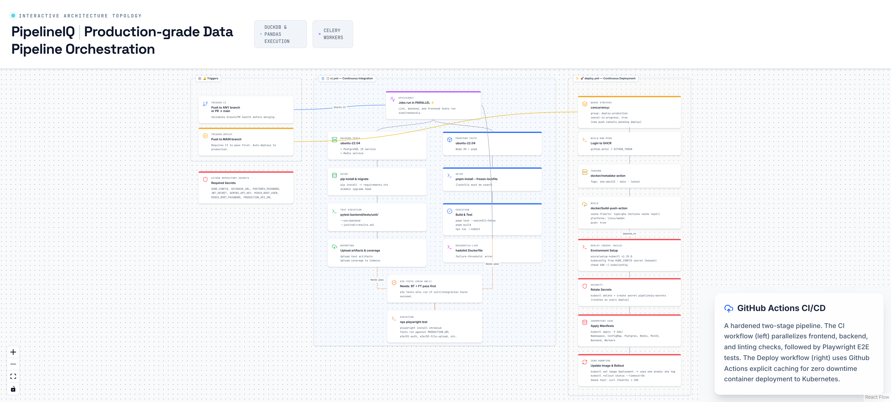

# 15. GitHub Actions CI/CD Pipeline

> Two-workflow CI/CD: parallel testing on every push, zero-downtime deployment on main.

## Architecture Diagram



---

## Overview

PipelineIQ uses two GitHub Actions workflows: `ci.yml` runs on every push and PR to validate code quality through parallel backend tests, frontend tests, and Dockerfile linting. `deploy.yml` runs only on main branch pushes, building a Docker image, pushing to GHCR, and deploying to the Civo k3s cluster with zero-downtime rolling updates and smoke testing. The deploy workflow uses concurrency groups to cancel in-progress deployments when a new push arrives.

---

## Workflow 1 — ci.yml (All Pushes and PRs)

### Trigger Conditions

- Push to ANY branch
- Pull request targeting main

### Parallel Jobs

| Job | Runner | Services | Steps |
|-----|--------|----------|-------|
| `backend-tests` | ubuntu-22.04 | PostgreSQL 15, Redis | pip install, alembic upgrade, pytest with coverage, Codecov upload |
| `frontend-tests` | ubuntu-22.04 | Node 20 + pnpm | pnpm install --frozen-lockfile, pnpm test, pnpm build, tsc --noEmit |
| `dockerfile-lint` | ubuntu-22.04 | — | hadolint Dockerfile (failure-threshold: error) |
| `e2e-tests` | ubuntu-22.04 | — | playwright install chromium, playwright test against production URL |

### Job Dependencies

```
backend-tests ─────┐
                    ├──> e2e-tests (main branch only)
frontend-tests ────┘
dockerfile-lint (independent)
```

The `e2e-tests` job requires both `backend-tests` and `frontend-tests` to pass first. It only runs on the main branch (not on PRs) to avoid testing against production from feature branches.

### Backend Test Steps

1. **Setup**: ubuntu-22.04 + PostgreSQL 15 service + Redis service
2. **Install**: `pip install -r requirements.txt`
3. **Migrate**: `alembic upgrade head`
4. **Test**: `pytest backend/tests/unit/ --cov=backend --junitxml=results.xml`
5. **Report**: Upload test artifacts + coverage to Codecov

### Frontend Test Steps

1. **Setup**: ubuntu-22.04 + Node 20 + pnpm
2. **Install**: `pnpm install --frozen-lockfile`
3. **Test**: `pnpm test --watchAll=false`
4. **Build**: `pnpm build`
5. **Type Check**: `npx tsc --noEmit`

### E2E Test Steps

1. **Prerequisite**: backend-tests + frontend-tests pass
2. **Browser**: `playwright install chromium`
3. **Test**: `npx playwright test` against `PRODUCTION_URL`

---

## Workflow 2 — deploy.yml (Main Branch Only)

### Trigger Conditions

- Push to main branch only
- Requires CI to pass first (implicit via branch protection)

### Concurrency Control

```yaml
concurrency:
  group: deploy-production
  cancel-in-progress: true
```

New pushes cancel any in-progress deployment. Only the latest commit deploys.

### Job: build-and-push

| Step | Action | Details |
|------|--------|---------|
| 1 | Login to GHCR | `docker/login-action` with `GITHUB_TOKEN` |
| 2 | Metadata | `docker/metadata-action` — tags: `sha-abc123`, `main`, `latest` |
| 3 | Build & Push | `docker/build-push-action` — GHA cache, `linux/amd64`, push to GHCR |

### Job: deploy (needs: build-and-push)

| Step | Action | Details |
|------|--------|---------|
| 1 | Setup kubectl | `azure/setup-kubectl v1.29.0` |
| 2 | Decode kubeconfig | Base64 decode `KUBE_CONFIG` secret |
| 3 | Rotate secrets | `kubectl delete + create secret pipelineiq-secrets` |
| 4 | Apply manifests | `kubectl apply -f k8s/` (idempotent) |
| 5 | Update images | `kubectl set image deployment` for each deployment |
| 6 | Wait for rollout | `kubectl rollout status --timeout=5m` |
| 7 | Smoke test | `curl /healthz` + `curl /readyz` → must return 200 |

### Smoke Test

After deployment, the workflow runs two health checks:
- `GET /healthz` → Simple 200 check (no DB dependency)
- `GET /readyz` → Checks DB + Redis connectivity, returns 200 only when all dependencies are healthy

If either fails, the deployment is considered failed and GitHub Actions reports the error.

---

## Required GitHub Secrets

| Secret | Purpose | Used In |
|--------|---------|---------|
| `KUBE_CONFIG` | kubectl config (base64 encoded) | deploy.yml |
| `DATABASE_URL` | PostgreSQL connection string | deploy.yml (secret rotation) |
| `POSTGRES_PASSWORD` | PostgreSQL password | deploy.yml (secret rotation) |
| `JWT_SECRET` | JWT signing secret | deploy.yml (secret rotation) |
| `GEMINI_API_KEY` | Google Gemini API key | deploy.yml (secret rotation) |
| `MINIO_ROOT_USER` | MinIO access key | deploy.yml (secret rotation) |
| `MINIO_ROOT_PASSWORD` | MinIO secret key | deploy.yml (secret rotation) |
| `PRODUCTION_URL` | Production frontend URL | ci.yml (e2e tests) |
| `PRODUCTION_API_URL` | Production API URL | ci.yml (e2e tests) |

---

## Docker Image Tags

| Tag Format | Example | Purpose |
|------------|---------|---------|
| `sha-{hash}` | `sha-abc123def` | Exact commit traceability |
| `main` | `main` | Latest main branch build |
| `latest` | `latest` | Default tag for convenience |

Images are stored in GitHub Container Registry: `ghcr.io/USERNAME/pipelineiq-backend:{tag}`

---

## Deployment Strategy

1. **Zero-downtime**: Kubernetes rolling update with `maxSurge=1, maxUnavailable=0`
2. **Secret rotation**: Secrets deleted and recreated on every deploy (ensures fresh credentials)
3. **Idempotent apply**: `kubectl apply -f k8s/` is safe to run multiple times
4. **Rollout wait**: `kubectl rollout status --timeout=5m` blocks until all pods are ready
5. **Smoke test**: HTTP health checks confirm the deployment is serving traffic

---

## Key Source Files

- `.github/workflows/ci.yml` — CI workflow definition
- `.github/workflows/deploy.yml` — CD workflow definition
- `k8s/` — Kubernetes manifests (namespace, deployments, services, ingress)
- `Dockerfile` — Container build definition
