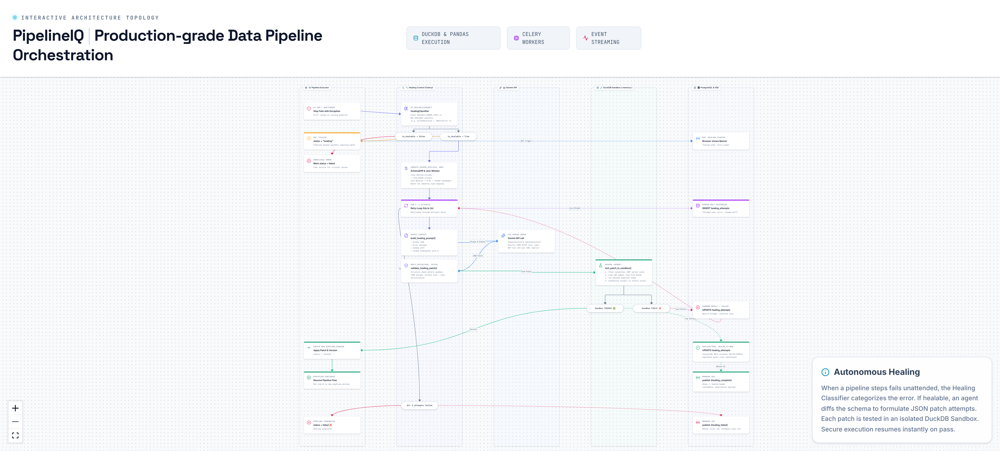

# 5. Autonomous AI Healing Agent



---

## Overview

PipelineIQ's Autonomous AI Healing Agent is a self-repair system that detects schema-drift pipeline failures, generates targeted JSON patches via Gemini AI, validates fixes in an ephemeral DuckDB sandbox, and either applies the fix or fails gracefully — all without human intervention. The system is designed to handle the most common class of pipeline failures (column renames, type changes, missing columns) automatically at 3AM.

---

## Complete Healing Flow

### Step 1: Error Detection and Classification

When a pipeline step raises an exception, the `HealingClassifier` checks whether the error is healable:

**HEALABLE error types** (`HEALABLE_ERROR_TYPES`):
- `ColumnNotFoundError` — column renamed or missing
- `KeyError` — dictionary key changed
- `MergeError` — join key mismatch
- `ValueError` — often caused by unexpected column values

**NOT HEALABLE error types** (`NOT_HEALABLE_ERROR_MESSAGE_PATTERNS`):
- `MemoryError` — out of memory (infrastructure issue)
- `AttributeError` — code bug (not schema drift)
- `PermissionError` — access control issue
- Network/timeout errors — infrastructure issue

### Step 2: Schema Diff Computation

If the error is classified as healable:

1. **Load old schema** from the pipeline's file profiles (what the pipeline expects)
2. **Load new schema** from the actual data (what the file now contains)
3. **Compute diff** using `SchemaDiff`:
   - `find_removed_columns()`: columns in old but not in new
   - `find_added_columns()`: columns in new but not in old
   - `find_rename_candidates()`: pairs of removed/added columns with Jaro-Winkler similarity >= 0.85

**Jaro-Winkler similarity** is used because:
- It's edit-distance based (handles typos, not just exact matches)
- It weights prefix matches more heavily ("revenue" → "rev_usd" scores higher)
- Threshold 0.85 balances precision (no false positives) with recall (catches real renames)
- Same semantic type (e.g., both are `float64`) boosts confidence

### Step 3: Healing Attempts (up to 3)

For each attempt:

1. **Record attempt** in `healing_attempts` table
   - PostgreSQL RULE prevents DELETE and UPDATE (immutable audit trail)
   - Stores: attempt_num, error, schema_diff, gemini_patch, sandbox_result

2. **Build healing prompt** (`build_healing_prompt()`)
   - Injects: broken YAML, error message, schema diff, rename candidates with similarity %
   - Instructs Gemini to return a JSON PATCH, NOT full YAML rewrite

3. **Call Gemini** via `call_gemini_task` (gemini queue, temperature=0.0)
   - Temperature 0.0: deterministic, same broken YAML always produces same fix
   - JSON PATCH format: `{confidence, step_name, field, old_value, new_value}`
   - Why JSON patch instead of full YAML: 3-field object vs 30-line YAML = 10x smaller hallucination surface

4. **Validate patch structure** (`validate_healing_patch()`)
   - Check that patch has required fields
   - Check that step_name exists in the pipeline
   - Check that old_value matches current config

5. **Apply patch** (`apply_patch(yaml, patch)`)
   - Generate candidate YAML with the patch applied

6. **Test in sandbox** (`test_patch_in_sandbox()`)
   - Fresh `duckdb.connect(':memory:')` — NOT the worker's connection
   - Load 100 sample rows from MinIO (not full dataset)
   - Run patched pipeline steps against sample data
   - Connection closed in `finally` block (always, even on crash)
   - Result: `{success: bool, output_rows: int}`

### Step 4: Sandbox Result

**Sandbox PASSES:**
- Apply patch to live pipeline YAML
- Create new `pipeline_version` record (versioning)
- Record in `healing_attempts`: `applied=True`, `healed_at=now`
- Status → `HEALED`
- Resume execution with patched pipeline
- Break out of retry loop

**Sandbox FAILS:**
- Record attempt result in `healing_attempts`
- Continue to next attempt (up to 3 total)

**All 3 attempts failed:**
- Status → `FAILED`
- SSE event: `{event_type: "healing_failed", attempts: 3}`

---

## Why JSON Patch (Not Full YAML)

| Approach | Hallucination Surface | Risk |
|----------|----------------------|------|
| Full YAML rewrite | ~30 lines of generated content | High — any line could be wrong |
| JSON PATCH | 3 fields: `step_name`, `field`, `old_value` → `new_value` | Low — minimal generation surface |

Example JSON patch:
```json
{
  "confidence": 0.92,
  "step_name": "filter_revenue",
  "field": "column",
  "old_value": "revenue",
  "new_value": "rev_usd"
}
```

This targets the exact field that needs to change, minimizing the chance of introducing new errors.

---

## Sandbox Safety

| Property | Value |
|----------|-------|
| Connection | Fresh `duckdb.connect(':memory:')` per test |
| Data | 100 sample rows from MinIO (not full dataset) |
| Isolation | NOT the worker's DuckDB connection |
| Cleanup | `connection.close()` in `finally` block |
| Result | `{success: bool, output_rows: int}` |

---

## Immutability

The `healing_attempts` table uses PostgreSQL RULEs:

```sql
CREATE RULE healing_attempts_no_delete AS
  ON DELETE TO healing_attempts DO INSTEAD NOTHING;

CREATE RULE healing_attempts_no_update AS
  ON UPDATE TO healing_attempts DO INSTEAD NOTHING;
```

This creates an immutable audit trail of all healing attempts. Every attempt is recorded forever — no one can delete or modify the history.

---

## SSE Events

| Event | When | Browser Behavior |
|-------|------|-----------------|
| `healing_started` | Healing begins | Shows healing banner with spinner |
| `healing_attempt_started` | New attempt (1, 2, or 3) | Updates attempt counter |
| `healing_attempt_applied` | Patch applied, sandbox passed | Shows "Applying fix..." |
| `healing_complete` | Pipeline re-executed successfully | Shows green "healed" badge |
| `healing_failed` | All attempts exhausted | Shows red "healing failed" |
| `healing_non_healable` | Error classified as not healable | Shows "manual intervention needed" |

---

## Configuration

| Setting | Default | Purpose |
|---------|---------|---------|
| `AUTONOMOUS_HEALING_ENABLED` | `true` | Master toggle for healing |
| `AUTONOMOUS_HEALING_MAX_ATTEMPTS` | `3` | Max healing attempts per failure |
| `HEALING_MODEL_TEMPERATURE` | `0.0` | Deterministic patch generation |

---

## Key Source Files

| File | Lines | Purpose |
|------|-------|---------|
| `backend/execution/healing_agent.py` | 527 | Main healing orchestration |
| `backend/execution/healing_classifier.py` | 72 | Error classification logic |
| `backend/execution/schema_diff.py` | 102 | Jaro-Winkler rename detection |
| `backend/execution/sandbox.py` | 269 | Ephemeral DuckDB sandbox |
| `backend/execution/patch_applier.py` | 174 | JSON patch application |
| `backend/tasks/pipeline_tasks.py` | 1114 | `_execute_with_autonomous_healing()` integration |
