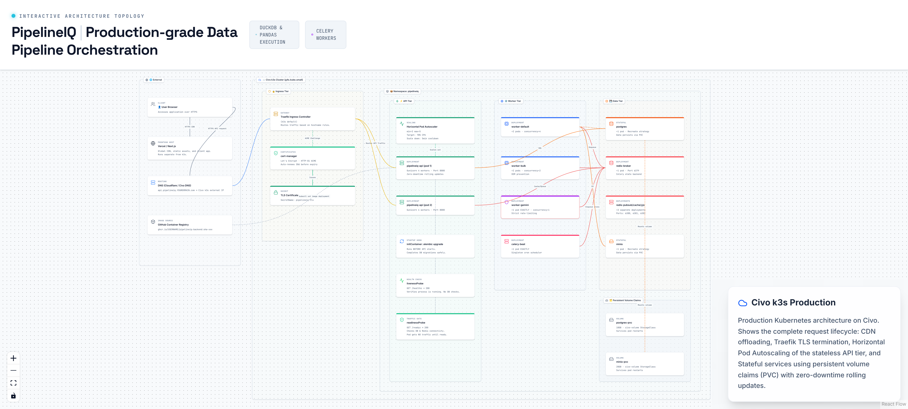

# 16. Civo k3s Kubernetes Deployment

> Production Kubernetes deployment with zero-downtime rolling updates, HPA autoscaling, and persistent storage.

## Architecture Diagram



---

## Overview

PipelineIQ deploys to a Civo k3s cluster (g4s.kube.small — 2 vCPU, 4GB RAM, ~$12/month) with a three-tier architecture: Ingress (Traefik + cert-manager), API (Gunicorn + HPA), and Data (PostgreSQL, 4× Redis, MinIO). The deployment uses rolling updates for zero-downtime API deployments, init containers for database migrations, liveness/readiness probes for health checking, and persistent volume claims for data durability.

---

## Cluster Specification

| Property | Value |
|----------|-------|
| Provider | Civo |
| Plan | g4s.kube.small |
| Resources | 2 vCPU, 4GB RAM |
| Cost | ~$12/month |
| Runtime | k3s (lightweight Kubernetes) |
| Ingress Controller | Traefik (k3s default) |
| TLS | cert-manager + Let's Encrypt (HTTP-01 ACME) |

---

## Tier Architecture

### Ingress Tier

| Component | Purpose | Details |
|-----------|---------|---------|
| Traefik | Reverse proxy + load balancer | k3s default ingress controller |
| cert-manager | Automatic TLS certificates | Let's Encrypt HTTP-01 ACME challenge |
| TLS Secret | `pipelineiq-tls` | Auto-renews 30 days before expiry |

Routes `pipelineiq-api.onrender.com` → `pipelineiq-api` service (ClusterIP).

### API Tier

| Component | Replicas | Configuration |
|-----------|----------|---------------|
| pipelineiq-api | 2 (HPA managed) | Gunicorn 4 workers, Port 8000 |
| initContainer | — | `alembic upgrade head` (runs BEFORE API starts) |
| HPA | min=2, max=5 | CPU > 70%, scale down 5min cooldown |

### Worker Tier

| Component | Replicas | Concurrency | Queue |
|-----------|----------|-------------|-------|
| worker-default | 2 | 4 | critical + default |
| worker-bulk | 2 | 2 | bulk |
| worker-gemini | 1 (singleton) | 1 | gemini |
| celery-beat | 1 (singleton) | — | — |

### Data Tier

| Component | Replicas | Port | PVC | Storage |
|-----------|----------|------|-----|---------|
| postgres | 1 | 5432 | postgres-pvc | 10GB |
| redis-broker | 1 | 6379 | — | — |
| redis-pubsub | 1 | 6380 | — | — |
| redis-cache | 1 | 6381 | — | 1GB maxmem |
| redis-yjs | 1 | 6382 | — | — |
| minio | 1 | 9000 | minio-pvc | 20GB |

---

## Deployment Strategies

### Rolling Update (API Tier)

```yaml
strategy:
  type: RollingUpdate
  rollingUpdate:
    maxSurge: 1
    maxUnavailable: 0
```

- Kubernetes starts NEW pod BEFORE stopping old pod
- New pod must pass `readinessProbe` before traffic routes to it
- Old pod kept running until new pod is ready
- **Result: Zero-downtime deployments**

### Recreate (Data Tier)

```yaml
strategy:
  type: Recreate
```

- PostgreSQL and MinIO use Recreate strategy
- Old pod terminated before new pod starts
- Data persists via PVC (Persistent Volume Claim)
- Used for stateful workloads where rolling update would cause split-brain

---

## Health Probes

| Probe | Endpoint | Interval | Timeout | Behavior |
|-------|----------|----------|---------|----------|
| `livenessProbe` | `GET /healthz` | 10s | 5s | Simple 200 check (no DB dependency). Restarts pod if fails. |
| `readinessProbe` | `GET /readyz` | 10s | 5s | Checks DB + Redis connectivity. No traffic until ready. |

The `readinessProbe` ensures that new pods don't receive traffic until they can actually serve requests (database connected, Redis reachable).

---

## HPA (Horizontal Pod Autoscaler)

| Property | Value |
|----------|-------|
| Target | `pipelineiq-api` |
| Min replicas | 2 |
| Max replicas | 5 |
| Scale trigger | CPU utilization > 70% |
| Scale up | Immediate when threshold exceeded |
| Scale down | After 5 minutes below threshold |

HPA monitors CPU usage and automatically scales the API tier between 2 and 5 replicas. The 5-minute cooldown on scale-down prevents flapping.

---

## Persistent Volume Claims

| PVC | Size | StorageClass | Component | Survives |
|-----|------|-------------|-----------|----------|
| `postgres-pvc` | 10GB | civo-volume | postgres | Pod restarts, redeployments |
| `minio-pvc` | 20GB | civo-volume | minio | Pod restarts, redeployments |

The `civo-volume` StorageClass provides block storage that persists across pod restarts and node failures.

---

## Init Containers

The `pipelineiq-api` deployment includes an initContainer that runs `alembic upgrade head` BEFORE the main API container starts. This ensures database migrations are applied before any API pod serves traffic.

```
initContainer: alembic upgrade head
    ↓ (must succeed)
main container: gunicorn -w 4 -b 0.0.0.0:8000
```

---

## External Dependencies

| Component | Location | Purpose |
|-----------|----------|---------|
| Vercel | Global CDN | Next.js frontend (static site) |
| DNS | Route53/Cloudflare | `pipelineiq-api.onrender.com` |
| GHCR | GitHub Container Registry | Docker image storage |

Frontend is deployed separately on Vercel (global CDN). Backend API is on Civo k3s. DNS routes traffic to the ingress controller.

---

## Traffic Flow

```
User Browser → HTTPS → DNS → Traefik Ingress → pipelineiq-api Service → API Pod(s)
                                                                     → worker-default Pod(s)
                                                                     → worker-bulk Pod(s)
                                                                     → worker-gemini Pod(s)
```

---

## Key Source Files

- `k8s/` — All Kubernetes manifests (namespace, deployments, services, ingress)
- `Dockerfile` — Container build definition
- `docker-compose.yml` — Local development equivalent
- `k8s/hpa.yaml` — HPA configuration for API tier
- `k8s/ingress.yaml` — Traefik ingress + cert-manager TLS
