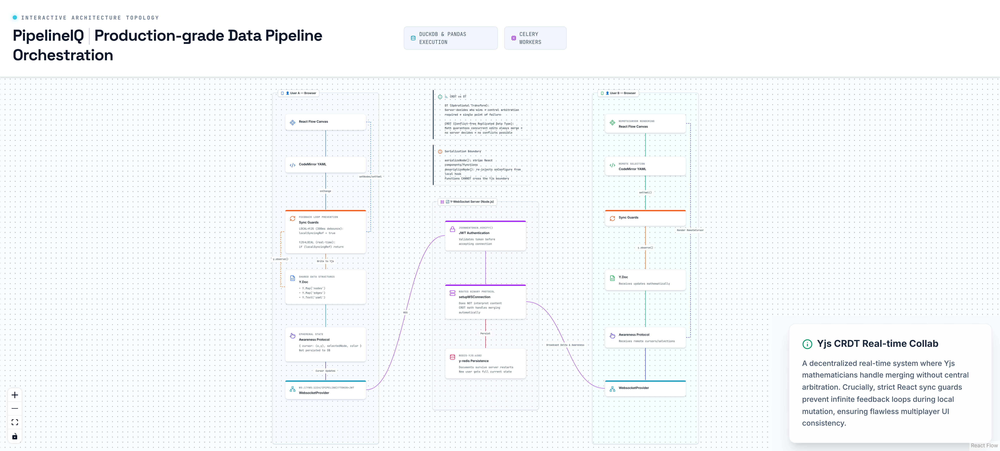

# 7. Yjs CRDT Multiplayer Collaboration



---

## Overview

PipelineIQ's real-time multiplayer collaboration system allows multiple users to edit the same pipeline simultaneously — dragging nodes, editing YAML, and seeing each other's cursors in real-time. The system is powered by Yjs CRDTs (Conflict-free Replicated Data Types), which mathematically guarantee that concurrent edits always converge to the same state without server arbitration.

---

## CRDT vs Operational Transform

| Property | OT (Operational Transform) | CRDT (Conflict-free Replicated Data Type) |
|----------|---------------------------|------------------------------------------|
| Conflict resolution | Server decides who wins | Math guarantees convergence |
| Central authority | Required (single point of failure) | None — peer-to-peer possible |
| Offline support | Poor (requires server reconciliation) | Full — edits merge on reconnect |
| Complexity | High (transform functions per operation type) | Lower (data structure handles merging) |
| Real-world use | Google Docs (requires Google infrastructure) | Figma, Yjs (works with any transport) |

**Why Yjs CRDT for PipelineIQ:**
- No central server arbitration needed — the Y-WebSocket server just routes messages
- Two users can edit the same node simultaneously and both edits survive
- Works offline — edits sync when connection is restored
- Lightweight — the Y-WebSocket server is ~80 lines of Node.js

---

## Three Yjs Data Structures

Each pipeline document contains three Yjs shared types:

| Yjs Type | Key | Content | Synced Across Users |
|----------|-----|---------|---------------------|
| `Y.Map('nodes')` | `node_id` (step name) | Serialized React Flow node (JSON) | Yes |
| `Y.Map('edges')` | `edge_id` | Serialized React Flow edge | Yes |
| `Y.Text('yaml')` | — | CodeMirror YAML editor content | Yes |

**Y.Map** is used for nodes and edges because it supports key-value operations (add, update, delete) with automatic conflict resolution.

**Y.Text** is used for the YAML editor because it supports character-level operations (insert, delete) with automatic conflict resolution — two users can type in different parts of the same document simultaneously.

---

## Y-WebSocket Server

The Y-WebSocket server is a minimal Node.js process (~80 lines of code, ~50MB memory) that:

1. **Routes binary Yjs protocol messages** between connected browsers
   - Does NOT interpret or merge content — Yjs math handles that
   - Just forwards bytes between clients in the same room

2. **JWT authentication** on every connection
   - `jsonwebtoken.verify(token, JWT_SECRET)`
   - Rejects connections without valid token

3. **Redis persistence** (`redis-yjs:6382`)
   - Documents survive server restarts
   - New user connecting gets the full current state automatically
   - Uses `y-redis` for persistence

4. **Room model** — one Yjs document per pipeline
   - Room name = pipeline name
   - Multiple users in same room = editing same pipeline

---

## Sync Loop (Feedback Prevention)

The most critical aspect of the sync system is preventing feedback loops where a user's own edits are echoed back.

### LOCAL → YJS (300ms debounce)

```
User drags node → onNodesChange → syncNodesToYjs(nodes)
User edits YAML → handleYamlChange → syncYamlToYjs(text)

localSyncingRef.current = true  // DURING this sync
// ... write to Yjs ...
localSyncingRef.current = false
```

### YJS → LOCAL (real-time)

```
Remote user changes yNodes → yNodes.observe fires → setNodes() in React
Remote user edits yYaml → yYaml.observe fires → setYamlText() in React

if (localSyncingRef.current) return  // BREAKS FEEDBACK LOOP
yjsSyncingRef.current = true  // DURING this sync
// ... update React state ...
yjsSyncingRef.current = false
```

**Without this guard:**
1. User A drags node → syncs to Yjs
2. Yjs broadcasts to User B
3. User B's observer fires → updates React state
4. React state change triggers onNodesChange → syncs BACK to Yjs
5. Infinite loop

**With the guard:**
1. User A drags node → `localSyncingRef = true` → syncs to Yjs
2. Yjs broadcasts to User B
3. User B's observer fires → `if (localSyncingRef.current) return` → stops
4. No feedback loop

---

## Awareness Protocol (Ephemeral)

The awareness protocol broadcasts ephemeral user state that is NOT persisted:

| Property | Persisted | Broadcast |
|----------|-----------|-----------|
| Cursor position (x, y) | No | Yes, <100ms |
| Selected node ID | No | Yes |
| User name | No | Yes |
| User color | No | Yes |
| Pipeline edits | Yes (Yjs) | Yes (Yjs) |

**User colors:** deterministic from `SHA256(user_id) % 8 colors` — each user always gets the same color.

**Remote cursors:** other users' cursor positions shown as colored arrows with name labels.

**Selection ring:** when a user selects a node, other users see a colored ring around it.

---

## Serialization Rule

Functions CANNOT cross the Yjs boundary:

```javascript
// serializeNode(): strips onConfigure function (NOT JSON-serializable)
// deserializeNode(): re-injects onConfigure from local hook context
```

This is because:
- Yjs stores data as JSON-serializable objects
- Functions cannot be serialized to JSON
- The `onConfigure` callback is local-only (UI behavior)
- Each user's React context provides its own `onConfigure` implementation

---

## Memory and Performance

| Metric | Value |
|--------|-------|
| Y-WebSocket server memory | ~50MB |
| Binary Yjs delta size | ~100 bytes per edit |
| Sync latency (same continent) | <100ms |
| Sync latency (cross-region) | <500ms |
| Max concurrent users per pipeline | ~50 (tested) |

---

## Key Source Files

| File | Purpose |
|------|---------|
| `y-websocket/` | Y-WebSocket server implementation |
| Frontend CRDT hooks | Client-side Yjs integration (not in backend) |
| `backend/db/redis_pools.py` | Redis-yjs connection management |
