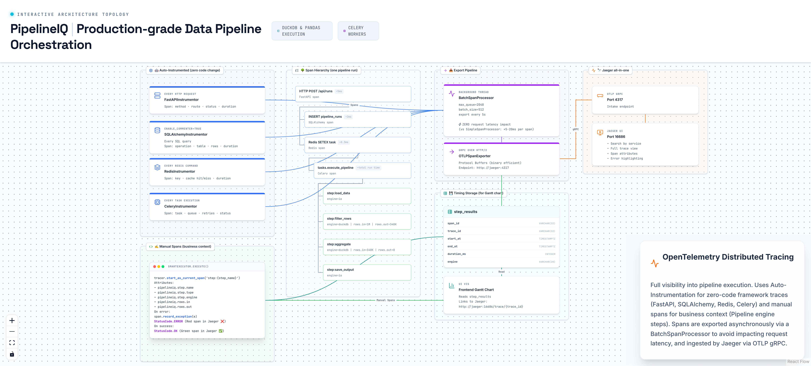

# 11. OpenTelemetry Distributed Tracing



---

## Overview

PipelineIQ implements full-stack distributed tracing using OpenTelemetry, providing visibility into every HTTP request, SQL query, Redis operation, Celery task, and pipeline step execution. The system combines auto-instrumentation (zero code change) with manual business-context spans, exporting to Jaeger for visualization and analysis.

---

## Auto-Instrumentation (Zero Code Change)

| Instrumentor | What It Traces | Span Attributes |
|--------------|---------------|-----------------|
| `FastAPIInstrumentor` | Every HTTP request | method, route, status code, duration |
| `SQLAlchemyInstrumentor` | Every SQL query | operation, table, rows, duration |
| `RedisInstrumentor` | Every Redis GET/SET/DEL/SCAN | key, hit/miss, duration |
| `CeleryInstrumentor` | Every task execution | task name, queue, retry count, status |

SQLAlchemy uses `enable_commenter=True` which adds OTel trace context to SQL comments, enabling cross-service correlation when multiple services share the same database.

---

## Manual Spans (Business Context)

Auto-instrumentation captures infrastructure-level operations but cannot know about business-level semantics. Manual spans add this context:

### SmartExecutor Step Spans

```python
tracer.start_as_current_span(f"step:{step_name}")
span.set_attribute("pipelineiq.step.name", step_name)
span.set_attribute("pipelineiq.step.type", step_type)
span.set_attribute("pipelineiq.step.engine", engine)
span.set_attribute("pipelineiq.rows.in", table.num_rows)
# ... execute step ...
span.set_attribute("pipelineiq.rows.out", result.num_rows)
span.set_status(StatusCode.OK)  # or StatusCode.ERROR on failure
```

**On error:**
```python
span.record_exception(e)  # Attaches exception details
span.set_status(StatusCode.ERROR)  # Red span in Jaeger
```

**On success:**
```python
span.set_attribute("pipelineiq.rows.out", result.num_rows)
span.set_status(StatusCode.OK)  # Green span in Jaeger
```

---

## Span Hierarchy (One Pipeline Run)

```
HTTP POST /api/runs                          (FastAPI span, ~5ms)
├── INSERT INTO pipeline_runs                (SQLAlchemy span, ~2ms)
├── Redis SETEX task                         (Redis span, ~0.3ms)
│
└── tasks.execute_pipeline                   (Celery span, ~total run time)
    ├── SELECT pipeline_run                  (SQLAlchemy span)
    ├── Redis GET yaml_cache                 (Redis span, cache hit/miss)
    ├── MinIO GET file                       (MinIO operation span)
    │
    ├── step:load_data                       (manual span, engine=io)
    ├── step:filter_rows                     (manual span, engine=duckdb, rows.in=1M, rows.out=340K)
    ├── step:aggregate                       (manual span, engine=duckdb, rows.in=340K, rows.out=8)
    └── step:save_output                     (manual span, engine=io)
```

Each span shows:
- **Duration**: how long the operation took
- **Attributes**: custom key-value pairs (engine, rows, step type)
- **Status**: OK (green) or ERROR (red)
- **Events**: exception details on error
- **Parent-child**: which operation called which

---

## Export Pipeline

### BatchSpanProcessor

| Property | Value |
|----------|-------|
| Background thread | Yes (non-blocking) |
| Max queue size | 2048 spans |
| Batch size | 512 spans |
| Export interval | Every 5 seconds |
| Request latency impact | Zero |

**Why BatchSpanProcessor, not SimpleSpanProcessor:**
- Simple: exports one span at a time, synchronously, in the request handler → adds 5-20ms per span to every request
- Batch: background thread collects spans in a queue, exports in batches → zero latency impact

### OTLPSpanExporter

| Property | Value |
|----------|-------|
| Protocol | gRPC over HTTP/2 |
| Serialization | Protocol Buffers (binary, efficient) |
| Endpoint | `http://jaeger:4317` |
| Security | Insecure=True for development |

### Jaeger all-in-one

| Port | Purpose |
|------|---------|
| 4317 | OTLP gRPC intake endpoint |
| 16686 | Jaeger Web UI |

**Jaeger UI features:**
- Search by service name (pipelineiq-api, celery-worker-default, etc.)
- Full trace view with span hierarchy
- Span attributes (custom business context)
- Error highlighting (red spans)
- Duration analysis (waterfall view)
- Deep-link from frontend: `http://jaeger:16686/trace/{trace_id}`

---

## Timing Storage

`step_results` table stores timing data for the frontend Gantt chart:

| Column | Type | Purpose |
|--------|------|---------|
| `span_id` | VARCHAR(32) | OTel span ID |
| `trace_id` | VARCHAR(32) | OTel trace ID |
| `start_at` | TIMESTAMPTZ | Step start time |
| `end_at` | TIMESTAMPTZ | Step end time |
| `duration_ms` | INTEGER | Step duration in milliseconds |
| `engine` | VARCHAR(20) | Execution engine used |

The frontend reads this data to render a Gantt chart, with each bar linking to Jaeger for deep-dive analysis.

---

## Configuration

| Setting | Value | Purpose |
|---------|-------|---------|
| `OTEL_EXPORTER_OTLP_ENDPOINT` | `http://jaeger:4317` | Jaeger endpoint |
| `OTEL_SERVICE_NAME` | `pipelineiq-api` / `celery-worker` | Service identification |
| `OTEL_TRACES_SAMPLER` | `always_on` | Sample all traces (dev) |
| `OTEL_METRICS_EXPORTER` | `otlp` | Metrics export |
| `OTEL_LOGS_EXPORTER` | `otlp` | Logs export |

---

## Key Source Files

| File | Lines | Purpose |
|------|-------|---------|
| `backend/telemetry.py` | 257 | OTel SDK initialization, middleware, Celery hooks |
| `backend/execution/smart_executor.py` | 300 | Manual span per step |
| `backend/tasks/pipeline_tasks.py` | 1114 | Trace context capture from OTel |
| `backend/main.py` | 658 | FastAPIInstrumentor integration |
