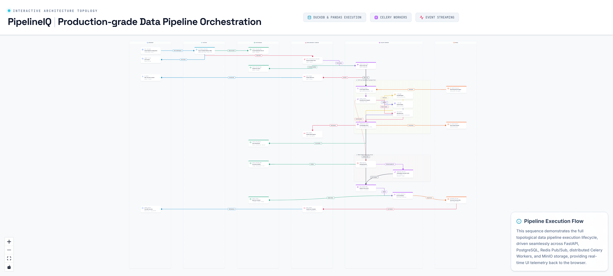

# 2. Data Pipeline Execution Flow

---

## Overview

This document describes the complete lifecycle of a single pipeline run in PipelineIQ — from the moment a user clicks "Run" to the final downloadable output. The flow involves seven distinct components communicating through HTTP, Redis, and PostgreSQL, with real-time progress streamed to the browser via Server-Sent Events.

---

## Complete Execution Flow

### Stage 1: Task Submission (Browser → FastAPI → Redis)

1. **Browser sends POST /api/runs** with YAML configuration and file references
   - Request body: `{yaml: "...", files: [file_id_1, file_id_2, ...]}`
   - Authentication: JWT token in Authorization header

2. **FastAPI validates the YAML**
   - `get_parsed_pipeline(yaml)` checks SHA256 cache in Redis first
   - Cache hit: reuse parsed config (microseconds)
   - Cache miss: parse YAML, validate step types, check file references, cache result
   - SHA256 key: `sha256(normalized_yaml)`

3. **PostgreSQL: INSERT pipeline_runs**
   - Record created with `status=pending`
   - Stores: run_id (UUID), yaml_config, user_id, name

4. **Redis Broker: apply_async(execute_pipeline)**
   - Task submitted to `default` queue
   - `execute_pipeline_task.apply_async(args=[run_id], queue="default")`
   - Returns immediately (microseconds)

5. **Browser receives 201 response** with `{run_id}`
   - Browser opens SSE connection to `/api/sse/pipeline_progress:{run_id}`

### Stage 2: Worker Pickup (Redis → Celery Worker → PostgreSQL)

6. **Celery worker pulls task** from `redis-broker:6379`
   - `prefetch_multiplier=1`: gets exactly 1 task
   - Task NOT acknowledged yet (`acks_late=True`)

7. **PostgreSQL: UPDATE status=running**
   - `pipeline_run.status = PipelineStatus.RUNNING`
   - `pipeline_run.started_at = utcnow()`
   - `pipeline_run.celery_task_id = self.request.id`

8. **Redis PubSub: publish progress event**
   - Channel: `pipeline_progress:{run_id}`
   - Payload: `{event_type: "pipeline_started", status: "running"}`
   - SSE service forwards to browser

### Stage 3: Step Execution (topological order)

For each step in the pipeline's topological order:

#### Load Step
9. **MinIO: get_object(file_id)**
   - Download source file from `pipelineiq-uploads` bucket
   - Read CSV, Parquet, JSON, or Excel into pandas DataFrame

10. **Column Policy Enforcement**
    - `apply_column_policies(df, user_role, policies)`
    - Redacted columns: `df.drop(columns=[col_name])`
    - Masked columns: apply pattern-based obscuring (email, phone, SSN, credit_card, custom)
    - Role override: admin users see full unmasked data

11. **Convert to Arrow Table**
    - `pa.Table.from_pandas(df)` for inter-step transport

#### Processing Steps (SmartExecutor)
12. **SmartExecutor routes by row count**
    - `wasm_compute` → WasmExecutor (any row count)
    - >= 50,000 rows → DuckDB (vectorized SQL)
    - < 50,000 rows → Pandas (Python operations)

13. **DuckDB Path** (if applicable)
    - `conn.register(table_alias, arrow_table)` — zero-copy
    - SQL Builder generates step-specific SQL
    - `conn.execute(sql).arrow()` — result as Arrow Table
    - `conn.unregister(table_alias)` — cleanup

14. **Pandas Path** (if applicable)
    - `pa.Table.to_pandas()` → DataFrame operation → `pa.Table.from_pandas()`

15. **WasmExecutor Path** (if wasm_compute)
    - Load `.wasm` bytes from MinIO `pipelineiq-wasm`
    - SHA256 module cache check
    - Fresh Store with fuel budget
    - Row-by-row f64 function calls

#### Save Step
16. **MinIO: put_object(output_bucket)**
    - Serialize Arrow Table to output format (CSV, Parquet, JSON)
    - Upload to `pipelineiq-outputs` bucket
    - Generate presigned download URL (48h expiry)

17. **PostgreSQL: UPDATE step_results**
    - Record: download_url, size_bytes, output_filename, output_format

#### Inter-Step Transport
18. **ArrowDataBus.store(key, table)**
    - Serialize to Arrow IPC bytes
    - Route to tier: Hot (<10MB Redis), Warm (10-500MB /dev/shm), Cold (>=500MB MinIO Parquet)

#### Progress Reporting
19. **PostgreSQL: INSERT step_results**
    - Record: span_id, trace_id, engine, start_at, end_at, duration_ms, row_in, row_out

20. **Redis PubSub: publish step_complete**
    - Payload: `{step_name, step_index, total_steps, status, rows_in, rows_out, duration_ms}`
    - SSE service forwards to browser
    - Browser updates Gantt chart in real-time

### Stage 4: Error Handling and Autonomous Healing

21. **Step raises exception**
    - Error caught by pipeline runner
    - `HealingClassifier.is_healable(error)` checks error type

22. **Classification result**

    **NOT healable** (MemoryError, AttributeError, etc.):
    - `status = FAILED` immediately
    - SSE event: `{event_type: "pipeline_failed", error_message: "..."}`

    **HEALABLE** (ColumnNotFoundError, KeyError, MergeError):
    - `status = HEALING` (NOT "failed")
    - SSE event: `{event_type: "healing_started", failed_step: "...", error_type: "..."}`
    - Browser shows healing banner

23. **Schema Diff computation**
    - `SchemaDiff.compute_schema_diff(old_profile, new_profile)`
    - `find_removed_columns()`, `find_added_columns()`
    - `find_rename_candidates()`: Jaro-Winkler similarity >= 0.85 = rename pair

24. **Healing attempts (up to 3)**
    - `build_healing_prompt()`: inject broken YAML + error + schema diff
    - Call Gemini (temperature=0.0, deterministic) via `call_gemini_task` (gemini queue)
    - Gemini returns JSON PATCH: `{confidence, step_name, field, old_value, new_value}`
    - `validate_healing_patch()` — structure check before sandbox
    - `apply_patch(yaml, patch)` → candidate YAML
    - `test_patch_in_sandbox()`: fresh DuckDB `:memory:`, 100 sample rows, run patched steps

25. **Sandbox result**
    - **Passes**: apply patch, create new pipeline version, `status=HEALED`, resume execution
    - **Fails**: record attempt, continue to next (up to 3 total)

26. **All attempts failed**: `status=FAILED`

### Stage 5: Post-Completion Hook

27. **Register run assets in data catalog**
    - `register_run_assets(run_id, pipeline_name, lineage_graph, owner_id)`
    - Upsert pipeline, file, column, topic assets
    - Insert relationship edges
    - Non-fatal: DB failure doesn't fail the run

28. **Contract validation**
    - `ContractValidator.validate(output_table, contract)`
    - Check 5 breach types: column_removed, type_changed, null_threshold, row_count, unexpected_column
    - If `severity=block` and blocking breach found → `status=contract_violation`

29. **Webhook delivery**
    - `fire_webhooks_for_event(run.success, payload, owner_id)`
    - For each matching webhook: `deliver_webhook.apply_async(queue='critical')`

30. **Arrow bus cleanup**
    - `ArrowDataBus.cleanup_run(run_id)` — delete all tier data for this run
    - Called in `finally` block (always runs)

31. **Presigned download URL**
    - Generated with 48h expiry
    - Stored in final step_result

### Stage 6: Terminal SSE Event

32. **Final status published**
    - `success`, `healed`, `contract_violation`, or `failed`
    - Includes: Gantt chart data, download URL, step results summary

33. **Browser receives final event**
    - Updates UI with final status badge
    - Shows download button
    - Gantt chart displays all step timings with Jaeger deep-links

---

## Pipeline Statuses

| Status | Meaning | Trigger |
|--------|---------|---------|
| `pending` | Created, waiting for worker | API creates run |
| `running` | Worker executing steps | Worker picks up task |
| `healing` | Autonomous AI repair in progress | Healable error detected |
| `healed` | Auto-repaired and completed successfully | Healing + re-execution succeeded |
| `completed` | All steps succeeded | All steps completed without error |
| `failed` | Non-healable error or all healing attempts exhausted | Error not classified as healable |
| `contract_violation` | Output violated data contract with `severity=block` | Contract breach detected |
| `cancelled` | User cancelled before completion | User action |

---

## Key Source Files

| File | Lines | Purpose |
|------|-------|---------|
| `backend/tasks/pipeline_tasks.py` | 1114 | Main orchestration task (`execute_pipeline_task`) |
| `backend/pipeline/runner.py` | — | `PipelineRunner.execute()` step loop |
| `backend/execution/smart_executor.py` | 300 | Step routing logic |
| `backend/execution/healing_agent.py` | 527 | Autonomous healing orchestration |
| `backend/execution/arrow_bus.py` | 722 | Inter-step data transport |
| `backend/api/sse.py` | 317 | Server-Sent Events endpoint |
| `backend/api/pipelines.py` | 1332 | Pipeline CRUD and run submission |
| `backend/contracts/` | — | Contract validation logic |
