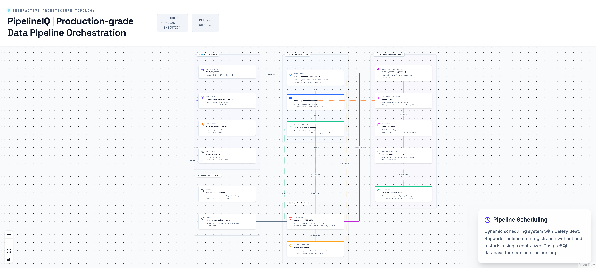

# 17. Pipeline Scheduling System

> Cron-based pipeline scheduling with dynamic Celery Beat registration and singleton enforcement.

## Architecture Diagram



---

## Overview

PipelineIQ implements cron-based pipeline scheduling with dynamic Celery Beat registration. User-created schedules are stored in PostgreSQL and dynamically registered with the running Beat instance at runtime. The system enforces singleton Beat deployment (exactly 1 replica) to prevent duplicate task firing. On Beat restart, all active schedules are reloaded from the database. The scheduling system supports create, pause, resume, delete, and preview operations, with human-readable cron descriptions and next-run predictions.

---

## Scheduling Components

| Component | Purpose | Replicas | Notes |
|-----------|---------|----------|-------|
| `pipeline_schedules` table | Stores cron expression + is_active + stats | — | PostgreSQL |
| Celery Beat | Fires tasks at scheduled times | 1 (singleton) | Multiple Beat = duplicate tasks |
| `register_schedule()` | Dynamic Beat registration at runtime | — | Adds to `beat_schedule` dict |
| `execute_scheduled_pipeline` task | Creates run + submits execution | — | Queue: bulk |
| `reload_all_active_schedules_from_db()` | Restores schedules on Beat restart | — | Called on Beat boot |

---

## Dynamic Registration

### Problem

Celery Beat reads its schedule from `celery_app.conf.beat_schedule` at startup. User-created schedules don't exist at startup time.

### Solution

1. **Create**: `POST /api/schedules` → creates DB record → calls `register_schedule()`
2. **Register**: `register_schedule()` adds to `celery_app.conf.beat_schedule` dict at runtime
3. **Reload**: Broadcasts `beat.reload` to the running beat worker
4. **Restore**: On beat restart: `reload_all_active_schedules_from_db()` restores all active schedules from DB

This ensures schedules survive Beat restarts (pod restarts, deployments) without manual intervention.

---

## Cron Lifecycle

| Action | API Endpoint | Effect |
|--------|-------------|--------|
| Create | `POST /api/schedules` | Validate cron → compute next_run_at → register in Beat |
| Pause | `POST /{id}/pause` | `is_active=False` → deregister from Beat |
| Resume | `POST /{id}/resume` | `is_active=True` → compute next_run_at → re-register |
| Delete | `DELETE /{id}` | Deregister → delete record (cascades schedule_runs) |
| Preview | `GET /{id}/preview` | `get_next_n_runs(5)` → shows next 5 fire times |

---

## Execution Flow

```
1. Beat fires execute_scheduled_pipeline(schedule_id)
2. Task loads schedule → checks is_active (last-minute check)
3. Creates ScheduleRun record (tracks this specific firing)
4. Creates PipelineRun with trigger='scheduled' + schedule_id FK
5. Calls execute_pipeline.apply_async(queue='bulk')
6. Updates schedule stats (total_runs++)
7. On completion: updates last_run_at, last_run_status, successful_runs/failed_runs
```

### Last-Minute Check

The task checks `is_active` again at execution time (not just at registration time). This handles the case where a user pauses a schedule between the Beat trigger and task execution.

### Run Tracking

Each firing creates a `ScheduleRun` record that links to the `PipelineRun` via `schedule_id` foreign key. This provides a complete audit trail of scheduled executions.

---

## Human-Readable Cron

`cron_to_human()` converts cron expressions to human-readable descriptions:

| Cron Expression | Human-Readable |
|----------------|----------------|
| `0 6 * * 1` | "every Monday at 6:00 AM" |
| `0 9 * * 1-5` | "weekdays at 9:00 AM" |
| `0 0 1 * *` | "first day of every month at midnight" |
| `*/5 * * * *` | "every 5 minutes" |

Uses a 50-entry lookup table for common patterns. Falls back to building description from individual cron parts.

---

## Singleton Requirement

**2 Beat instances = each fires every task = duplicate runs at every interval.**

This is enforced in the Kubernetes manifests:

```yaml
# celery-beat deployment
spec:
  replicas: 1  # MUST be exactly 1 — multiple Beat = duplicate scheduled tasks
```

---

## Data Model

### pipeline_schedules Table

| Column | Type | Description |
|--------|------|-------------|
| `id` | UUID | Primary key |
| `cron` | TEXT | Cron expression (5 fields) |
| `is_active` | BOOLEAN | Whether schedule is enabled |
| `next_run_at` | TIMESTAMP | Predicted next fire time |
| `last_run_at` | TIMESTAMP | Last execution time |
| `last_run_status` | TEXT | 'success' or 'failed' |
| `total_runs` | INTEGER | Total execution count |
| `successful_runs` | INTEGER | Successful execution count |
| `failed_runs` | INTEGER | Failed execution count |
| `pipeline_id` | UUID FK | Pipeline to execute |
| `owner_id` | UUID FK | User who created schedule |

### schedule_runs Table

| Column | Type | Description |
|--------|------|-------------|
| `id` | UUID | Primary key |
| `schedule_id` | UUID FK | Reference to pipeline_schedules |
| `triggered_at` | TIMESTAMP | When this firing occurred |
| `pipeline_run_id` | UUID FK | Reference to pipeline_runs |

---

## Key Source Files

- `backend/scheduling/` — Schedule CRUD and Beat management
- `backend/tasks/scheduled_pipeline.py:112` — Scheduled execution task
- `backend/api/schedules.py:377` — Schedule API endpoints
- `backend/celery_config.py` — Beat schedule configuration
