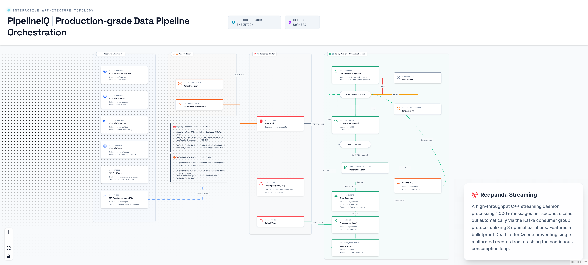

# 8. Redpanda Streaming Architecture



---

## Overview

PipelineIQ uses Redpanda as its streaming backbone — a C++ reimplementation of Apache Kafka that uses the same wire protocol but requires only 600MB of RAM instead of Kafka's 3GB. This makes it viable for a 16GB development laptop running 25+ containers. The streaming system supports real-time data processing with pause/resume/stop controls, dead letter queues for error preservation, and live metrics monitoring.

---

## Why Redpanda Instead of Kafka

| Property | Apache Kafka | Redpanda |
|----------|-------------|----------|
| Language | Java (JVM) | C++ |
| RAM for broker | 2GB+ | 600MB |
| Dependencies | ZooKeeper or KRaft | Single container |
| Total footprint | ~3GB | ~600MB |
| Protocol | Kafka wire protocol | Same Kafka wire protocol |
| Consumer groups | Full support | Full support |
| Partitioning | Full support | Full support |
| Retention policies | Full support | Full support |

**The math:** On a 16GB laptop with Docker running PostgreSQL, Redis (×4), MinIO, FastAPI, Celery workers (×5), the frontend, and 10+ other services, Kafka's 3GB footprint would consume 20% of available RAM. Redpanda's 600MB fits comfortably.

---

## Bottleneck #15 Fix — 8 Partitions

The original implementation used 1 partition per topic, which limited throughput to 1 active consumer:

| Partitions | Active Consumers | Throughput |
|------------|-----------------|------------|
| 1 | 1 max | 1 Python process |
| 8 | 8 in same consumer_group | 8x throughput |

**How it works:**
- Kafka consumer group protocol distributes partitions automatically
- Each consumer in the group gets assigned exclusive partitions
- No partition is consumed by more than one consumer in the same group
- 8 partitions = 8 consumers = 8x parallel processing

---

## Complete Streaming Pipeline Lifecycle

### Start Streaming (POST /api/streaming/start)

1. **Validate YAML** has a `stream_consume` step
2. **Create PipelineRun** record in PostgreSQL (status=pending)
3. **Submit Celery task** `run_streaming_pipeline` (queue=default, max_retries=0)

### The Streaming Daemon Loop

The daemon runs indefinitely until stopped:

```
1. Create topics (8 partitions) if they don't exist
2. Create DLQ topic ({source_topic}.dlq, 1 partition)
3. Set up Kafka Consumer (confluent-kafka)
4. Set up Kafka Producer (confluent-kafka, linger_ms=10, snappy compression)
5. Check run status every iteration:
   - streaming_stopped → break loop
   - streaming_paused → poll without consuming
6. consumer.consume(batch_size=1000, timeout=5s)
7. Filter PARTITION_EOF (not an error — end of current partition)
8. Deserialize batch: JSON → pandas DataFrame
9. Execute processing steps (skip stream_consume and stream_publish)
   → Uses same SmartExecutor + DuckDB as batch mode
10. Publish results to output topic
11. Update streaming_runs stats every 5 seconds
12. On batch failure: send to DLQ
```

### PARTITION_EOF Handling

`PARTITION_EOF` is NOT an error — it means the consumer has reached the end of the current partition. This is normal behavior when:
- No new messages have been produced yet
- The producer is slower than the consumer
- The topic is being replayed from the beginning

The daemon filters these out and continues polling.

---

## DLQ (Dead Letter Queue)

| Property | Value |
|----------|-------|
| Topic name | `{source_topic}.dlq` |
| Partitions | 1 (low volume, errors only) |
| Headers added | `x-error`, `x-original-topic`, `x-original-partition`, `x-failed-at` |
| Purpose | Preserve failed messages for inspection and reprocessing |

**Why DLQ matters:**
- In stream processing, a single bad message can crash the entire pipeline
- Without DLQ, that message is lost or the pipeline is stuck
- With DLQ, the message is preserved with error context for investigation
- Failed messages can be replayed after fixing the issue

**Inspector:** `GET /api/topics/{name}/dlq` — lists failed messages with error headers.

---

## Pause / Resume / Stop

Controlled by `PipelineRun.status` in PostgreSQL (not a separate signal):

| Action | API Call | Status Change | Daemon Behavior |
|--------|----------|---------------|-----------------|
| Pause | `POST /{id}/pause` | `streaming_paused` | Stops consuming but stays alive |
| Resume | `POST /{id}/resume` | `streaming_active` | Resumes consuming |
| Stop | `POST /{id}/stop` | `streaming_stopped` | Exits loop, `consumer.close()` |

The daemon checks `PipelineRun.status` every loop iteration — no separate signal mechanism needed.

---

## Producer Configuration

| Property | Value | Purpose |
|----------|-------|---------|
| `linger_ms` | 10 | Batch messages for 10ms before sending |
| Compression | Snappy | Fast compression with good ratio |
| Key routing | Column-based | Messages with same key go to same partition |

---

## Streaming Runs Statistics

The `streaming_runs` table tracks live metrics:

| Metric | Updated | Purpose |
|--------|---------|---------|
| `total_messages` | Every batch | Total messages processed |
| `total_batches` | Every batch | Total batches processed |
| `error_batches` | On failure | Failed batches count |
| `dlq_messages` | On DLQ send | Messages sent to DLQ |
| `messages_per_second` | Every 5s | Throughput metric |
| `last_batch_latency_ms` | Every 5s | Processing latency |
| `consumer_lag` | Every 5s | Per-partition lag |

---

## Key Source Files

| File | Purpose |
|------|---------|
| `backend/streaming/` | Streaming daemon implementation |
| `backend/routers/streaming.py:261` | Streaming lifecycle API |
| `backend/celery_config.py` | Streaming queue configuration |
