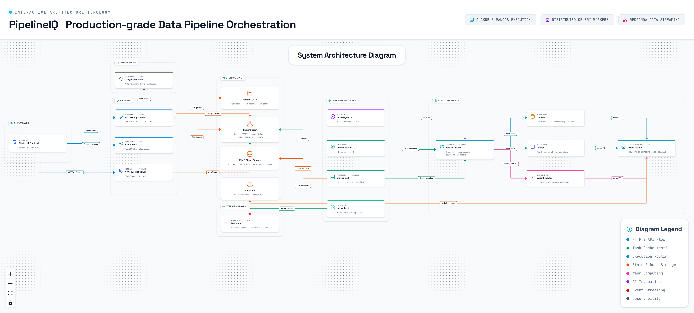

# 1. Overall System Architecture

---

## Overview

PipelineIQ is a production-grade data pipeline orchestration platform built with a microservices-inspired architecture. The system is designed to handle data pipeline execution, real-time collaboration, autonomous AI healing, and comprehensive observability — all within a lightweight Kubernetes deployment costing approximately $12/month.

The architecture follows a strict separation of concerns across seven distinct layers: Client, API, Task, Execution, Storage, Streaming, and Observability. Each layer communicates through well-defined interfaces, enabling independent scaling and deployment.

---

## Layer-by-Layer Breakdown

### 1. Client Layer

The client layer consists of two components that handle all user-facing interactions.

**Next.js 14 Frontend (Vercel)**
- Deployed on Vercel's global CDN for edge-level performance
- Built with Next.js 14 App Router for server-side rendering and streaming
- React Flow provides the visual pipeline canvas — a node-based editor where users drag, connect, and configure pipeline steps
- CodeMirror powers the YAML editor with syntax highlighting, autocomplete, and linting
- Yjs integrates real-time collaborative editing directly into both React Flow and CodeMirror
- The frontend communicates with the backend via HTTPS REST API calls and Server-Sent Events for real-time updates

**Y-WebSocket Server**
- A lightweight Node.js process (~50MB memory footprint)
- Routes binary Yjs protocol messages between connected browsers
- Does NOT interpret or merge content — Yjs CRDT math handles conflict resolution
- JWT authentication via `jsonwebtoken.verify()` on every connection
- Redis persistence (`redis-yjs:6382`) ensures documents survive server restarts
- Room model: one Yjs document per pipeline, identified by pipeline name
- Handles awareness protocol: cursor positions, selected nodes, user colors (ephemeral, not persisted)

### 2. API Layer

**FastAPI Application**
- Running under Gunicorn with 4 worker processes on port 8000
- Pydantic BaseSettings for configuration management (`backend/config.py`)
- Structured JSON logging for production, human-readable for development
- Middleware stack: API version header, request ID injection, timing, structlog access logging
- Exception handlers for `ClientDisconnected` (499), `PipelineIQError` (422), `RequestValidationError` (422), and unhandled exceptions (500)
- Route mounting for 15+ endpoint groups: API, auth, webhooks, audit, AI, WASM, streaming, catalog, lineage export, column policies, contracts, runs, debug
- Health check endpoints: `/livez` (liveness), `/readyz` (readiness), `/health` (comprehensive)
- Prometheus metrics instrumentation for request duration, status codes, and custom business metrics
- SHA256 YAML cache: identical pipeline configurations are parsed once and reused

**SSE Service**
- Separate FastAPI process on port 8001
- Dedicated to Server-Sent Events streaming
- Subscribes to Redis PubSub channels for pipeline progress events
- Channels named `pipeline_progress:{run_id}`
- Events are signed with HMAC-SHA256 to prevent tampering
- Supports reconnection: cached latest progress payload in Redis (TTL: 1 hour)

### 3. Task Layer (Celery)

Four specialized Celery worker types, each with distinct resource profiles and queue assignments.

**worker-default (x2, concurrency=4)**
- Handles normal user-triggered pipeline runs
- Pulls from `default` and `critical` queues (critical has priority)
- `prefetch_multiplier=1`: worker gets 1 task at a time (prevents long tasks blocking short ones)
- `acks_late=True`: task acknowledged only after completion (crash-safe)
- Concurrency=4 balances throughput with memory usage

**worker-bulk (x2, concurrency=2)**
- Handles file profiling (`profile_file`) and scheduled pipeline runs (`execute_scheduled_pipeline`)
- Pulls from `bulk` queue only — no competition with user-triggered runs
- Lower concurrency=2 prevents OOM on large DataFrames during profiling
- Separate workers ensure scheduled runs don't impact interactive performance

**worker-gemini (x1, concurrency=1)**
- Handles ALL Gemini AI calls (`call_gemini_task`)
- Exactly 1 process with concurrency=1 — this is intentional and critical
- `rate_limit='50/m'`: additional enforcement layer (50 API calls per minute)
- `max_retries=5`: exponential backoff on 429 rate limit errors
- SHA256 response cache: identical prompts reuse cached results
- Token budget tracking: 900K tokens/minute rolling window in Redis
- **NEVER increase replicas**: defeats the rate limit design

**celery-beat (x1)**
- Singleton cron dispatcher — fires scheduled tasks at configured intervals
- **NEVER increase replicas**: multiple Beat instances = duplicate scheduled tasks
- Dynamic schedule registration: user-created schedules are added at runtime
- Reloads all active schedules from database on restart

### 4. Execution Engine

**SmartExecutor**
- Central routing component that receives every pipeline step
- Routes based on step type and row count:
  - `wasm_compute` steps → WasmExecutor (any row count)
  - Steps with >= 50,000 rows → DuckDB (vectorized SQL)
  - Steps with < 50,000 rows → Pandas (Python operations)
- Full OpenTelemetry tracing: step name, engine used, rows in/out, duration

**DuckDB**
- Vectorized analytical SQL engine
- Per-worker connection initialized by `worker_init` signal (NOT created per-step)
- Zero-copy Arrow-to-DuckDB registration via `conn.register(alias, arrow_table)`
- SQL Builder generates step-specific SQL for 11 step types
- Performance: ~12ms for GROUP BY + SUM on 1M rows (vs ~1.2s in Pandas)
- Steps supported: filter, select, sort, aggregate, join, deduplicate, fill_nulls, sample, pivot, unpivot, sql

**Pandas**
- Used for small datasets (< 50K rows) and complex Python logic
- Conversion: `pa.Table.to_pandas()` → DataFrame operations → `pa.Table.from_pandas()`
- Acceptable performance for small data; simpler for operations with no SQL equivalent

**WasmExecutor**
- WebAssembly UDF execution via Wasmtime runtime
- Empty Linker = no WASI = no filesystem/network/env access (sandboxed)
- Fuel-based CPU budget: `FUEL_PER_STEP = 10,000,000`, `FUEL_PER_ROW = 1,000`
- SHA256 module cache: compiled Module objects cached per-worker
- Fresh Store per execution: no state leakage between calls
- TrapError → None (continues to next row, not a crash)

**ArrowDataBus**
- Three-tier inter-step data transport
- Hot tier (< 10MB): Redis-cache, ~0.2ms latency, TTL 1 hour
- Warm tier (10-500MB): /dev/shm (Linux tmpfs), ~0.5ms latency, deleted on run completion
- Cold tier (>= 500MB): MinIO Parquet+Snappy, ~50ms latency, 2-day lifecycle
- Serialization: Arrow IPC (native binary, zero-copy) — NOT pickle
- Automatic eviction: when Redis memory > 90%, largest hot entries move to warm tier
- Idempotent cleanup: `cleanup_run()` deletes all tier data for a run

### 5. Storage Layer

**PostgreSQL 15**
- Primary datastore for all relational data
- PgBouncer connection pooling for efficient connection reuse
- Read replica for query distribution
- Tables: pipeline_runs, step_results, pipeline_schedules, data_assets, asset_relationships, pipeline_contracts, contract_breaches, column_policies, healing_attempts, wasm_modules, uploaded_files, file_profiles, users, audit_logs, webhook_deliveries, lineage_graphs, pipeline_versions
- PostgreSQL RULEs for immutability: healing_attempts, contract_breaches, webhook_deliveries (DELETE/UPDATE → INSTEAD NOTHING)
- GIN trigram index on data_assets.name for fast ILIKE search

**Four Redis Instances**
- `redis-broker:6379` — Celery task state and broker (PENDING/STARTED/SUCCESS/FAILURE)
- `redis-pubsub:6380` — SSE event channels (`pipeline_progress:{run_id}`)
- `redis-cache:6381` — 1GB LRU cache: YAML cache, policy cache, Arrow hot tier, response cache
- `redis-yjs:6382` — Yjs CRDT document state persistence

**MinIO**
- S3-compatible object storage
- Four buckets with lifecycle policies:
  - `pipelineiq-uploads` — User-uploaded source files
  - `pipelineiq-outputs` — Pipeline execution outputs
  - `pipelineiq-spills` — Arrow cold tier Parquet files (2-day lifecycle)
  - `pipelineiq-wasm` — WebAssembly module storage
- Presigned URLs for secure file access (48h expiry for downloads)
- Lifecycle policies for automatic cleanup

### 6. Streaming Layer

**Redpanda**
- Kafka-compatible streaming platform (same wire protocol)
- C++ reimplementation: 600MB RAM vs Kafka's 3GB
- Single-node deployment suitable for 16GB laptop with 25+ containers
- 8-partition topics for parallel consumption (Bottleneck #15 fix)
- DLQ (Dead Letter Queue) per topic: never lose a message
- Consumer group protocol distributes partitions automatically
- Streaming daemon runs indefinitely until stopped, checking PipelineRun.status each iteration

### 7. Observability Layer

**OpenTelemetry SDK**
- Auto-instrumented: FastAPI, SQLAlchemy, Redis, Celery (zero code change)
- Manual spans: SmartExecutor steps with business context (engine, rows, timing)
- BatchSpanProcessor: background thread, zero request latency impact
- OTLP gRPC export to Jaeger

**Jaeger**
- All-in-one deployment
- Port 4317: OTLP gRPC intake
- Port 16686: Web UI for trace search, span attributes, error highlighting
- Deep-link from frontend Gantt chart: `http://jaeger:16686/trace/{trace_id}`

---

## Key Source Files

| File | Purpose |
|------|---------|
| `backend/main.py` | FastAPI application factory, middleware stack, route mounting |
| `backend/config.py` | Pydantic BaseSettings with all environment configuration |
| `backend/celery_app.py` | Celery application with worker init/shutdown hooks |
| `backend/celery_config.py` | Queue routing and execution defaults |
| `backend/telemetry.py` | OpenTelemetry SDK initialization and instrumentation |
| `backend/execution/smart_executor.py` | Step routing between DuckDB and Pandas |
| `backend/execution/arrow_bus.py` | Three-tier Arrow IPC data bus |
| `backend/execution/wasm_executor.py` | WebAssembly UDF execution engine |
| `backend/tasks/pipeline_tasks.py` | Main pipeline orchestration task |
| `backend/sse_app.py` | SSE service (port 8001) |
