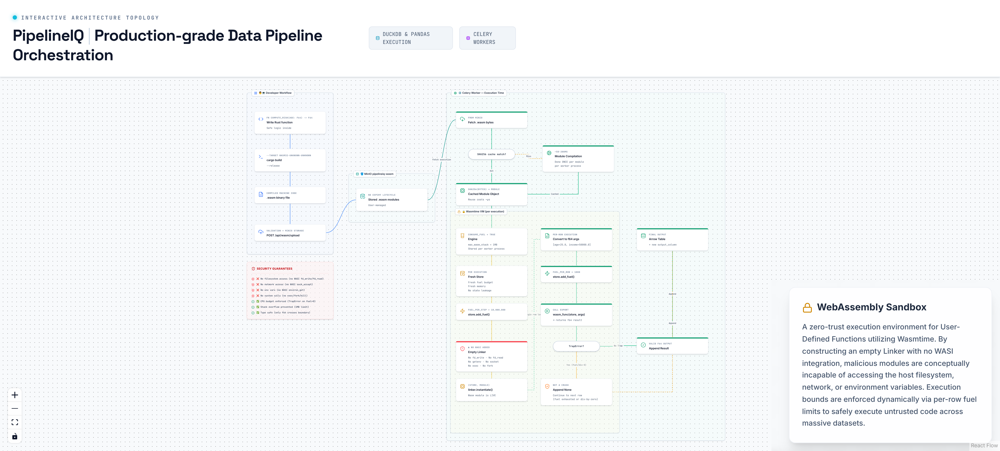

# 9. WebAssembly UDF Sandbox



---

## Overview

PipelineIQ's WebAssembly UDF (User-Defined Function) sandbox allows users to upload custom Rust/Wasm functions and execute them safely within pipeline steps. The security model is based on Wasmtime's fuel-based CPU budgeting and an empty Linker that provides zero access to host system resources — no filesystem, no network, no environment variables.

---

## Security Model

### What the Sandbox Prevents

| Access Type | Blocked? | Mechanism |
|-------------|----------|-----------|
| Filesystem read/write | Yes | No WASI `fd_write`/`fd_read` |
| Network (HTTP, DNS) | Yes | No WASI `sock_accept` |
| Environment variables | Yes | No WASI `environ_get` |
| System calls (exec/fork) | Yes | No WASI at all |
| CPU abuse | Yes | Fuel budget: 10M per step, 1K per row |
| Stack overflow | Yes | 1MB stack limit |
| Memory exhaustion | Yes | Fresh Store per execution |
| Infinite loops | Yes | Fuel exhaustion → TrapError → null result |

### Why Empty Linker Is the Security Mechanism

**WASI (WebAssembly System Interface)** is what grants filesystem/network access to Wasm modules. It's a set of host functions that a Wasm module can import:

```
fd_write    → file write
fd_read     → file read
sock_accept → network socket
environ_get → environment variables
proc_exit   → process exit
```

An **empty Linker** has no host functions available for Wasm to import. When a Wasm module tries to call `fd_write`, the import fails at instantiation time — the module cannot even start.

This is exactly how **Cloudflare Workers** isolate user code — they don't give Wasm modules any WASI imports.

---

## Developer Workflow

### 1. Write Rust Function

```rust
// Example: compute_risk score
#[no_mangle]
pub fn compute_risk(age: f64, income: f64, credit: f64) -> f64 {
    let age_factor = if age < 25.0 { 1.2 } else { 1.0 };
    let income_factor = income / 100_000.0;
    let credit_factor = credit / 850.0;
    (age_factor * income_factor * credit_factor * 100.0).min(100.0)
}
```

### 2. Compile to WebAssembly

```bash
cargo build --target wasm32-unknown-unknown --release
```

Output: `.wasm` binary file (compiled machine code, not interpreted)

### 3. Upload via API

```
POST /api/wasm/upload
Content-Type: multipart/form-data
Body: file=@compute_risk.wasm, name="compute_risk", description="..."
```

### 4. Validation

At upload time, Wasmtime:
1. Instantiates the module with an empty Linker
2. Lists all exported functions
3. Validates function signatures (only f64 arguments and return values)
4. Stores module in MinIO `pipelineiq-wasm` bucket

### 5. Reference in Pipeline YAML

```yaml
pipeline:
  steps:
    - name: compute_risk_score
      type: wasm_compute
      wasm_file_id: "abc-123"
      function: "compute_risk"
      input_columns: ["age", "income", "credit_score"]
      output_column: "risk_score"
```

---

## Execution Flow

### At Runtime

1. **Fetch .wasm bytes** from MinIO `pipelineiq-wasm` bucket

2. **SHA256 module cache check** — per-worker, compiled once
   - `SHA256(wasm_bytes)` → compiled `Module` object
   - Compilation: ~50-200ms (done once per module per worker)
   - Cache lookup: ~microseconds
   - Cache lifetime: worker process lifetime

3. **Wasmtime Engine** — shared per worker process
   - `consume_fuel = True` — enables fuel-based CPU budgeting
   - `max_wasm_stack = 1MB` — prevents stack overflow

4. **Fresh Store** — created per execution
   - Fresh fuel budget: `store.add_fuel(FUEL_PER_STEP = 10,000,000)`
   - Fresh memory: no state leakage between executions
   - No shared state between different pipeline runs

5. **Empty Linker** — no WASI added
   - `linker = wasmtime.Linker(store.engine)`
   - No `linker.define_wasi()` call — this is the security boundary

6. **Instantiate module**
   - `instance = linker.instantiate(store, module)`
   - If the module imports any host function → instantiation fails (TrapError)

7. **Row-by-row execution**
   ```
   For each row in the Arrow Table:
     a. Convert columns to f64 arguments
     b. store.add_fuel(FUEL_PER_ROW = 1,000)
     c. wasm_func = instance.exports(store)["compute_risk"]
     d. result = wasm_func(store, age, income, credit)
     e. If TrapError (fuel exhausted, divide-by-zero):
        result = None (not a crash — continue to next row)
     f. Append result to output column
   ```

8. **Output** — Arrow Table with new `output_column` added

---

## Module Cache

| Property | Value |
|----------|-------|
| Key | `SHA256(wasm_bytes)` |
| Value | Compiled Wasmtime `Module` object |
| Lifetime | Worker process lifetime |
| Compilation time | ~50-200ms (done once) |
| Cache lookup | ~microseconds |
| Amortized cost | Negligible for repeated executions |

---

## Fuel Budget

| Budget | Value | Purpose |
|--------|-------|---------|
| `FUEL_PER_STEP` | 10,000,000 | Total fuel for entire step execution |
| `FUEL_PER_ROW` | 1,000 | Fuel added before each row call |
| Total rows per step | ~10,000 max | Before fuel exhaustion |

When fuel runs out:
- Wasmtime raises a `TrapError`
- The row result is set to `None` (not a crash)
- Execution continues to the next row
- This prevents infinite loops from hanging the pipeline

---

## Validation

At upload time, the Wasm module is validated:

1. **Compile check** — Wasmtime compiles the module
2. **Instantiation check** — Module instantiates with empty Linker
3. **Export check** — Lists exported functions, validates signatures
4. **Function signature check** — Only f64 arguments and return values allowed
5. **No WASI check** — Module should not require WASI imports

If any check fails, the upload is rejected with a descriptive error.

---

## Key Source Files

| File | Lines | Purpose |
|------|-------|---------|
| `backend/execution/wasm_executor.py` | 273 | WasmExecutor class |
| `backend/routers/wasm.py` | 342 | Upload, validation, listing endpoints |
| `backend/execution/wasm_validator.py` | — | Module validation |
| `backend/models/__init__.py` | 792 | WasmModule model |
