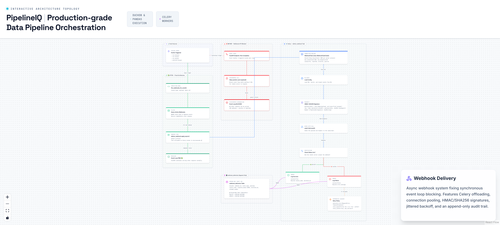

# 18. Webhook Delivery Architecture

> Async webhook delivery via Celery — fixes the synchronous httpx blocking bottleneck.

## Architecture Diagram



---

## Overview

PipelineIQ uses an async webhook delivery system that offloads HTTP calls from the FastAPI event loop to a dedicated Celery worker. Previously, synchronous `httpx.post()` calls blocked the event loop for 2-10 seconds per webhook, causing cascading delays when multiple webhooks fired simultaneously. The new architecture uses a `WebhookTask` base class with a shared `httpx.AsyncClient`, HMAC-SHA256 signatures, exponential backoff retries, and an append-only delivery log.

---

## Before vs After

| Property | Before (Bottleneck #11) | After (Fixed) |
|----------|------------------------|---------------|
| HTTP call | Synchronous `httpx.post()` | Async via Celery task |
| Event loop impact | Blocked for 2-10s per webhook | Free (microseconds) |
| 100 concurrent webhooks | Minutes blocked | Zero impact on API |
| Reliability | Lost on crash | Retry with exponential backoff |
| Delivery log | None | Append-only audit trail |
| Signature | None | HMAC-SHA256 per delivery |

---

## WebhookTask Design

| Property | Value |
|----------|-------|
| Base class | `WebhookTask(celery.Task)` |
| Shared client | `httpx.AsyncClient` (one per worker process) |
| Connection limits | max_connections=100, max_keepalive=20 |
| Timeouts | connect=5s, read=10s, write=5s, pool=2s |
| Queue | `critical` (highest priority) |
| Max retries | 3 |
| Backoff | Exponential: 2s, 4s, 8s + jitter |
| Autoretry for | `RequestError`, `TimeoutException` |

### Shared Client

Each worker process maintains ONE `httpx.AsyncClient` instance with connection pooling:
- `max_connections=100`: Total concurrent connections across all webhooks
- `max_keepalive=20`: Keep-alive connections for repeated calls to same endpoint
- Timeout: 5s connect, 10s read, 5s write, 2s pool

This prevents connection exhaustion and reuses TCP connections for efficiency.

---

## HMAC-SHA256 Signature

Every delivery is signed with HMAC-SHA256:

```python
payload_bytes = json.dumps(payload, sort_keys=True).encode()
signature = hmac.new(secret.encode(), payload_bytes, sha256).hexdigest()
# Header: X-PipelineIQ-Signature: sha256={signature}
```

Receivers verify this signature to confirm authentic delivery from PipelineIQ.

### Headers Sent

| Header | Value |
|--------|-------|
| `X-PipelineIQ-Signature` | `sha256={hmac_hex}` |
| `X-PipelineIQ-Event` | Event type (e.g., `run.success`) |
| `X-PipelineIQ-Delivery-ID` | UUID for idempotency |

---

## Delivery Log

`webhook_deliveries` table — immutable via PostgreSQL RULE:

```sql
CREATE RULE webhook_deliveries_no_delete AS
    ON DELETE TO webhook_deliveries DO INSTEAD NOTHING;

CREATE RULE webhook_deliveries_no_update AS
    ON UPDATE TO webhook_deliveries DO INSTEAD NOTHING;
```

| Column | Type | Description |
|--------|------|-------------|
| `webhook_id` | UUID FK | Which webhook was called |
| `event_type` | TEXT | Event that triggered delivery |
| `payload` | JSONB | Full payload sent |
| `status_code` | INTEGER | HTTP response code |
| `response_body` | TEXT | First 1000 chars of response |
| `duration_ms` | INTEGER | Round-trip time |
| `attempt_number` | INTEGER | Which attempt (1, 2, 3) |
| `success` | BOOLEAN | Whether delivery succeeded |
| `error_message` | TEXT | Error details on failure |

Every attempt logged, successful or not. The audit trail cannot be tampered with.

---

## Event Types

| Event | When Triggered |
|-------|----------------|
| `run.success` | Pipeline run completed successfully |
| `run.failed` | Pipeline run failed |
| `run.healed` | Pipeline run auto-healed |
| `contract.breach` | Data contract violation detected |

Webhooks filter by events list: `["run.success", "run.failed"]`. Only webhooks subscribed to a specific event receive deliveries for that event.

---

## Retry Behavior

| Attempt | Delay | Trigger |
|---------|-------|---------|
| 1 | Immediate | First attempt |
| 2 | 2s + jitter | RequestError or TimeoutException |
| 3 | 4s + jitter | RequestError or TimeoutException |
| 4 (final) | 8s + jitter | RequestError or TimeoutException |

Exponential backoff with jitter prevents thundering herd problems when multiple webhooks fail simultaneously.

---

## Integration Points

| Event Source | Function | Behavior |
|-------------|----------|----------|
| Pipeline completion | `fire_webhooks_for_event(event_type, payload, owner_id)` | Queries active webhooks, submits Celery tasks |
| Pipeline failure | Same function | Same flow, different event_type |
| Contract breach | Same function | Same flow, different event_type |

`fire_webhooks_for_event()` is called at the end of pipeline execution (success or failure) and on contract breach detection.

---

## Key Source Files

- `backend/tasks/webhook_tasks.py` — `deliver_webhook` Celery task
- `backend/services/webhook_service.py:159` — Webhook configuration and delivery
- `backend/api/webhooks.py:257` — Webhook CRUD API
- `backend/tasks/pipeline_tasks.py` — `fire_webhooks_for_event()` integration
